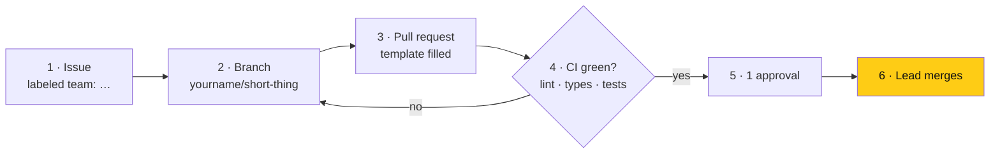

# Contributing

> **Owner:** [@nicolasrufino](https://github.com/nicolasrufino) · **Last reviewed:** Sep 29, 2026 · **Audience:** LOGICA members · **Type:** Reference

**Members only.** Contributions come from LOGICA @ UIC members in the `uic-logica` GitHub org. Pull requests from outside the org are closed. Not a member? [Join LOGICA](https://logicauic-logica5.vercel.app/join) first.

**Lead:** Nicolas Rufino ([@nicolasrufino](https://github.com/nicolasrufino)) — sets priorities and deadlines, reviews and merges.

## The workflow

| Rule | Why |
|---|---|
| Every change starts as an issue with a `team: …` label | Anyone can see who's building what |
| Branch `yourname/short-description`, never commit to `main` | Branch protection blocks it anyway |
| One PR per change, linked with `Closes #N` | Small reviews ship faster |
| Run `npm run lint` and `npx tsc --noEmit` before pushing | CI runs the same checks and blocks the merge |
| Decisions go in the repo (issue, PR or doc), not only Discord | The public record is the point |

## Team rhythm

| When | What |
|---|---|
| Every 2 days · 15 min · Discord | What I did (including what my agents did) · what's next · what's blocking me |
| Every change | Issue → branch → PR → review → merge |

## Design

The night design is the only spec: [`frontend/design/logica.pen`](https://github.com/uic-logica/frontend/tree/main/design) + [`frontend/DESIGN.md`](https://github.com/uic-logica/frontend/blob/main/DESIGN.md). A new screen gets designed there before it's built.

## Claude Code

Install the [`skills`](https://github.com/uic-logica/skills) plugin: `/logica-pr`, `/logica-review`, `/logica-test`, `/logica-issue`, `/logica-lean` run this workflow for you.

## Local setup

Each repo's README: [frontend](https://github.com/uic-logica/frontend#readme) · [backend](https://github.com/uic-logica/backend#readme).
