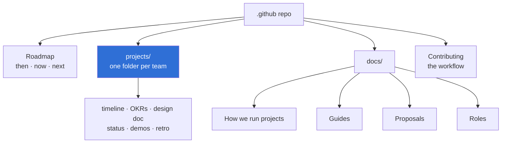

# LOGICA @ UIC — how we work

> **Owner:** [@nicolasrufino](https://github.com/nicolasrufino) · **Last reviewed:** Sep 29, 2026 · **Audience:** LOGICA members · **Type:** Landing page

This repo holds the plan and the process for every LOGICA project. The public overview is on the [org page](https://github.com/uic-logica).

| If you want to… | Read |
|---|---|
| See what we're building and when | [The roadmap](ROADMAP.md) |
| Find your team's plan, dates and docs | [Projects](projects/README.md) |
| Learn how a project runs, from OKRs to retro | [How we run projects](docs/how-we-run-projects/README.md) |
| Ship a change | [The contributing guide](CONTRIBUTING.md) |
| Join a Software Team | [Software Teams — Fall 2026](docs/guides/software-teams-fall-2026.md) |
| Suggest a new project | [Propose a project](docs/proposals/README.md) |
| Know what good work looks like in your role | [Frontend](docs/roles/frontend.md) · [Backend](docs/roles/backend.md) · [QA](docs/roles/qa.md) |

This repo also sets the default issue and PR templates for every repo in the org.
