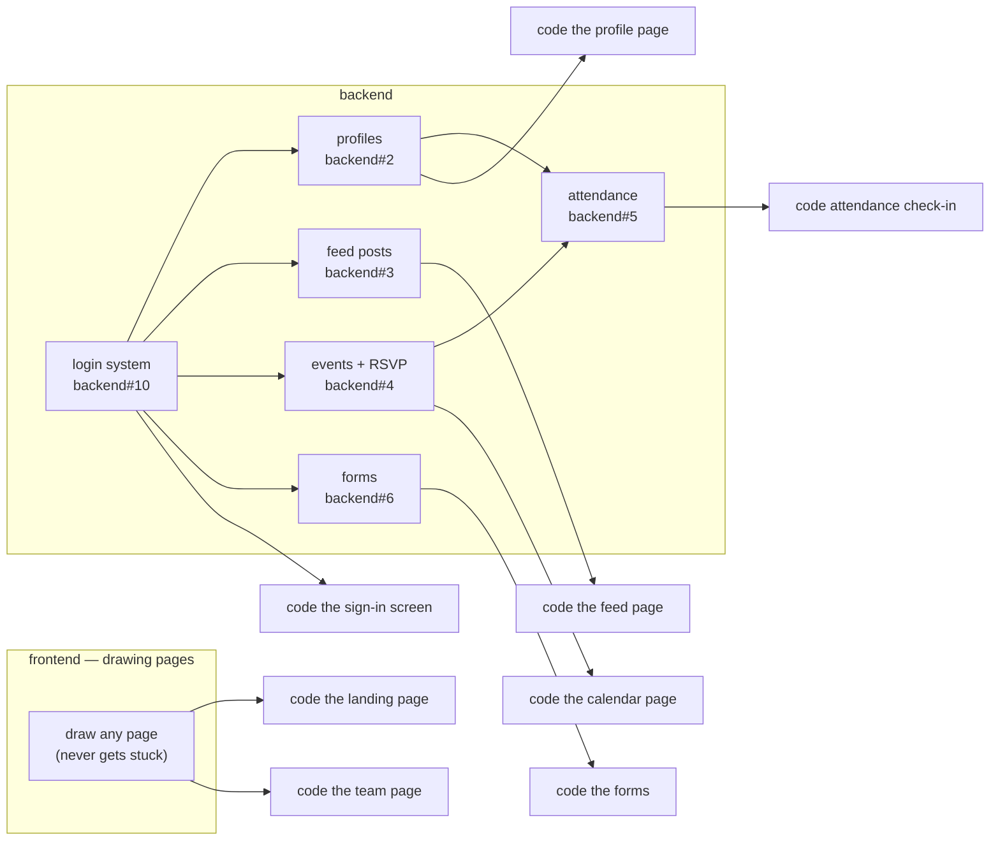

# Roadmap

How we're building LOGICA @ UIC, step by step. Steps are numbered because each one depends on the step before it — you can't build member profiles before you have logins. The **Additions** list at the bottom has no order; pick any of those up whenever, they don't block or get blocked by anything.

Each step's tracking issues live in the repo that does the work — check `frontend` and `backend` issues labeled `roadmap` for the current state.

**The step numbers below are not issue numbers.** A step here describes one feature, and a feature usually needs work in both repos. Each repo does that work in its own order, with its own labels — `[FE 1]`, `[FE 2]`… on `frontend`, `[BE 1]`, `[BE 2]`… on `backend`. Every issue says which step it belongs to. The two lists below are those orders.

## Frontend page order

The frontend does not follow the step numbers below. It works **one page at a time**, in this order — **flipped 2026-09-01** (see `frontend`#26): backend is shipping faster than frontend right now, so locking a mockup before any page hits the real API means designing against guesses about response shape.

1. **Skeleton** — a functional page wired to the real backend (`NEXT_PUBLIC_API_URL`): real data, real loading/empty/error states, unstyled or minimally styled. Proves the data shape before any visual decision gets locked in.
2. **Design** — once the skeleton's data shape is proven live, turn the research (art/interaction reference doc + that page's content doc) into an actual mockup in Figma, [Pencil](https://pen.dev), or equivalent.
3. **Share it** — a short `.md` in `frontend` with the link and a preview screenshot, PR'd, so it's reviewable without opening the design tool.
4. **Polish** — tune the skeleton in place to match that mockup.
5. **Then** start the next page.

See [`frontend`'s DESIGN.md](https://github.com/uic-logica/frontend/blob/main/DESIGN.md) for the full sequence, the visual direction, and the motion/performance bar.

| # | Page | Issue | Roadmap step | Blocked by backend? |
|---|------|-------|--------------|---------------------|
| 0 | Art/interaction reference doc + a content doc per page | frontend#18, #19 | — | no |
| 1 | Landing page | frontend#7 | Additions | no |
| 2 | Team / roles page | frontend#8 | Additions | no |
| 3 | Sign-in screen + session/role check | frontend#1 | Step 2 | yes — backend#10 |
| 4 | Profile page | frontend#2 | Step 3 | yes — backend#2 |
| 5 | Feed page + composer | frontend#3 | Step 4 | yes — backend#3 |
| 6 | Calendar + event pages | frontend#4 | Step 5 | yes — backend#4 |
| 7 | Attendance check-in + history | frontend#5 | Step 6 | yes — backend#5 |
| 8 | Form renderer + the two forms | frontend#6 | Step 7 | yes — backend#6 |

The remaining Additions (member spotlight, company-visit info page, cybersecurity showcase, sponsor wall) slot into this order whenever someone claims one — same skeleton-then-design-then-polish sequence.

**Rows 3-8 already have a bare-minimum skeleton** (throwaway, unstyled — not a substitute for step 1 above) covering sign-in through forms, wired to matching bare-bones backend endpoints for rows 3-8's backend issues too: `frontend`#27 and `backend`#15. Treat both as a rough starting reference for the real skeleton/backend work on each row, not finished work to build on top of — see each PR's description for specifics on what's missing.

## Backend order

| # | Work | Issue | Roadmap step | Status |
|---|------|-------|--------------|--------|
| 1 | Foundation: scaffold, CI, branch protection | backend#7 | Step 1 | done |
| 2 | Passwordless auth + roles | backend#10, #11 | Step 2 | backend done (backend#13, merged) — frontend#1 (sign-in screen) still open |
| 3 | Profiles: read/update + involvement summary | backend#2 | Step 3 | |
| 4 | Feed: `Post` model + CRUD API | backend#3 | Step 4 | |
| 5 | Events: `Event` model, RSVP, shareable-link data | backend#4 | Step 5 | |
| 6 | Attendance: model + check-in endpoint | backend#5 | Step 6 | |
| 7 | Forms: `Form`/`FormField`/`Submission` + API | backend#6 | Step 7 | |

The frontend's first two pages need no backend, so backend#10 is not holding anyone up right now — build it properly rather than fast.

## How the two teams work together

Nobody should be sitting around stuck. If you are, this section says what to do instead.

### What's waiting on what

### Almost everything is waiting on the login system

Six of the eight frontend pages only make sense for someone who's signed in, so none of them can be finished until backend#10 is done. The landing page and the team page are the exceptions — they're public, anyone can see them, no login needed.

That doesn't mean rush the login system. The next bit is why there's time.

### Drawing a page and coding a page are two different jobs

- **Drawing never gets stuck.** Any page can be drawn today. A mockup of the profile page doesn't need a working database behind it.
- **Coding gets stuck.** A page can only be coded once its drawing is finished *and* the backend piece it needs exists.

So day to day this should look like: the drawings stay a few pages ahead of the code. Eduardo and LizBCa keep drawing the next page; the backend builds pieces in the same order the pages are going to be coded. Nobody sits waiting.

### The backend should build things in the same order the pages get coded

Right now they match — profiles, then feed, then events on the backend lines up with the profile page, then the feed page, then the calendar page on the frontend. Keep it that way.

If the frontend changes which page it's doing next, the backend changes to match, and the other way around. Otherwise one team finishes something the other can't use yet, while sitting stuck on something nobody built.

### If you're stuck

**Frontend, waiting on the backend:**
1. Draw the next page. Drawing never gets stuck.
2. Write the content doc for a page that doesn't have one yet.
3. Go back to a page that's already coded and finish it properly — what it shows while it's loading, what it shows when there's nothing there yet, what it shows when something breaks, whether it works without a mouse, whether animations switch off for people who've asked for that in their system settings, and the speed target in DESIGN.md.
4. Claim an Addition — nothing blocks those.
5. **Don't fake the data to get moving.** File the backend issue, then pick something above.

**Backend, waiting:**
1. Move to the next thing on the backend list. Apart from the arrows in the picture above, those pieces don't depend on each other.
2. Write tests for what's already merged — backend#11 shows the shape.
3. Open the issue for the next piece, so the frontend can see what's coming.

**Either team, stuck waiting on a person:** say so in the group chat *and* in the issue. If nobody can see you're stuck, nobody can unstick you.

## Step 1 — Foundation
**Status: done.**
GitHub org, `frontend` + `backend` repos, branch protection, CI (lint + typecheck + build on every PR), issue/PR templates, roles (Member/Reviewer/Maintainer/Owner).

## Step 2 — Auth + roles
**Status: backend done (backend#13, merged, closed backend#10) — frontend#1 (sign-in screen) still open.**
Members sign in with their UIC (`.edu`) email — no third-party OAuth (no "Sign in with Google"), and no passwords. Passwordless instead: a one-time code emailed to them, and/or a passkey saved to their device once they've set one up. The backend stores three membership roles: `MEMBER`, `BOARD`, `EXEC_BOARD`. Role decides what a member can see and do everywhere else in the app.

- **Backend:** sign-in restricted to the UIC email domain, passwordless (one-time emailed code and/or WebAuthn passkey — no Google OAuth, no passwords), roles stored on the `User` model, database-backed sessions. The exact mechanism (code, passkey, or both) is the backend owner's call to make while building — see backend#10. The existing `auth.ts` was built on Google OAuth and needs reworking to match this.
- **Frontend:** the sign-in screen and the session/role check — `[FE 3]`, frontend#1. The screen gets designed whenever; the build waits on a working session from the backend before any page can check "who's logged in, what's their role." The frontend's first two pages (landing, team) don't need this, so it isn't blocking frontend work today.

Depends on: Step 1.

## Step 3 — Member profiles
Every member has a profile: name, major, grad year, bio, and a summary of their involvement (events attended, posts made, forms submitted). You can edit your own; you can view everyone else's.

- **Backend:** endpoint to read/update a profile; an "involvement" summary computed from the tables that come online in later steps.
- **Frontend:** profile page — editable self-view, read-only public view.

Depends on: Step 2 (needs a logged-in user).

## Step 4 — Feed / announcements
One place members land and see what's happening — announcements, upcoming events, spotlights. Board and Exec Board can post; everyone can read.

- **Backend:** `Post` model, CRUD API, posting restricted to `BOARD`/`EXEC_BOARD` by a server-side role check.
- **Frontend:** feed page, post composer for board members.

Depends on: Step 2 (role check needs auth).

## Step 5 — Calendar + events
Club calendar. Every event gets its own page with a shareable, embeddable link — so it can go out on Instagram, a group chat, anywhere off-site.

- **Backend:** `Event` model, RSVP, an endpoint that returns embeddable event data for the shareable link.
- **Frontend:** calendar view, individual event pages, RSVP button, "copy link" / embed snippet.

Depends on: Step 2.

## Step 6 — Attendance tracking
Track who actually showed up, not just who RSVP'd. Feeds the involvement summary on profiles (Step 3).

- **Backend:** `Attendance` model tied to `Event` + `User`, a check-in endpoint (code or QR based).
- **Frontend:** check-in flow for whoever's running the door, "my attendance history" on profile.

Depends on: Step 5 (needs events to check into), Step 3 (attendance feeds involvement).

## Step 7 — Forms system
A general-purpose form builder, used first for two concrete forms: startup-partner intake and company-visit signup. Built in-house, not Google Forms, so submissions live in our own database and tie back to member profiles and companies.

- **Backend:** generic `Form` / `FormField` / `Submission` models, submit + list endpoints.
- **Frontend:** a renderer that reads a form schema and draws the inputs, the two concrete forms built on top of it, a submissions view for board members.

Depends on: Step 2 (submissions tie to a logged-in member where relevant).

## Additions
These are suggestions, not a required list — a starting menu, not a mandate. No dependency order — start any of these whenever, they don't block the numbered steps and aren't blocked by them.

- Landing page (public homepage content and design)
- Team / roles page (who's on Exec Board / Board, photos + bios)
- Member spotlight (recurring feature on a member, shown on feed/landing)
- Company-visit info page (public info page; the signup form itself is Step 7)
- Cybersecurity showcase page (space for security-focused work/writeups)
- Sponsor / partner wall (logos + links for supporting companies)

### Got an idea that's not on this list?

That's genuinely welcome. LOGICA isn't meant to enforce one person's roadmap on everyone — it's a shared structure and vision to build under, and there's room for your own idea inside that. You don't need permission to start something different, just visibility: write a short `.md` file in [`additions/`](additions) explaining what you want to build and why, PR it in, and let the team know. That's it — see [`additions/README.md`](additions/README.md) for the exact steps.
