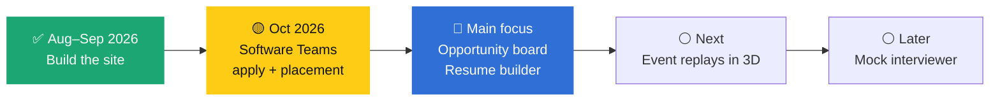
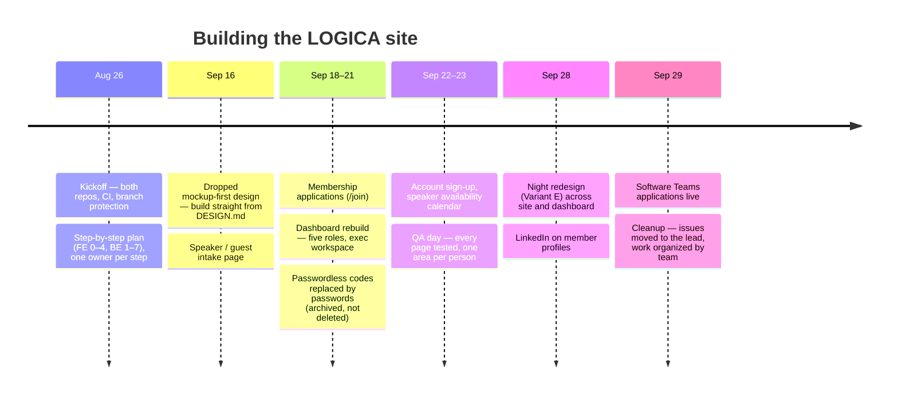

# Roadmap

> **Owner:** [@nicolasrufino](https://github.com/nicolasrufino) · **Last reviewed:** Sep 29, 2026 · **Audience:** Members and recruiters · **Type:** Plan

LOGICA @ UIC is building two things: **the club site** (live) and **four products that help students get hired** (starting October 2026, one team each).

```mermaid
flowchart LR
  A["✅ Aug–Sep 2026<br/>Build the site"] --> B["🟡 Oct 2026<br/>Software Teams<br/>apply + placement"]
  B --> C["🔵 Main focus<br/>Opportunity board<br/>Resume builder"]
  C --> D["⚪ Next<br/>Event replays in 3D"]
  D --> E["⚪ Later<br/>Mock interviewer"]
  style A fill:#1BA673,color:#fff,stroke:#1BA673
  style B fill:#FECC15,color:#111,stroke:#FECC15
  style C fill:#2F6FD6,color:#fff,stroke:#2F6FD6
```

## Now — October 2026

| What | Where | Status |
|---|---|---|
| Members apply to Software Teams from the dashboard | [site](https://logicauic-logica5.vercel.app/dashboard/teams) · frontend#91 · backend#64 | 🟢 Open |
| Review applications, interviews, team placement | exec dashboard → Applications | 🟡 In progress |
| Team kickoffs | Thu Oct 1 · issues labeled `team: …` | ⚪ After placement |

Placement rule: **people who have contributed the most get priority**, then the application and a short interview. Details: [Software Teams — Fall 2026](docs/guides/software-teams-fall-2026.md).

## Next — the products

Each product has a team page with scope, first milestone and roles.

| Product | Team page | Label | Priority |
|---|---|---|---|
| Opportunity board — scrapers, feed by class year, tracker | [projects/opportunity-board/](projects/opportunity-board/) | `team: opportunity-board` | 🔵 Main focus |
| Resume builder — your own AI over MCP, one proven template | [projects/resume-builder/](projects/resume-builder/) | `team: resume-builder` | 🔵 Main focus |
| Event replays in 3D — computer vision, faces blurred | [projects/event-replays/](projects/event-replays/) | `team: event-replays` | ⚪ Next |
| Mock interviewer — voice practice via MCP | [projects/mock-interviewer/](projects/mock-interviewer/) | `team: mock-interviewer` | ⚪ Later |
| The site itself — upkeep | [projects/site/](projects/site/) | `team: site` | Ongoing |

Every product starts with a **two-week spike**: prove the hard part works on one laptop before it touches the site.

### Demo days

| Team | MVP (internal preview) | Code freeze | **Demo day** | Public release | Retro |
|---|---|---|---|---|---|
| 🔵 Opportunity board | Fri Oct 30 | Sun Nov 8 | **Thu Nov 12** | Fri Nov 13 | Tue Nov 17 |
| 🟠 Resume builder | Fri Oct 30 | Sun Nov 15 | **Thu Nov 19** | Fri Nov 20 | Mon Nov 23 |
| 🟢 Event replays | — | Tue Dec 1 | **Thu Dec 3** (showcase) | — | Sat Dec 5 |
| ⚪ Mock interviewer | — | — | **Thu Dec 3** (preview) | — | Sat Dec 5 |

Code ships every Friday from **Oct 23** (release train). Demo writeups, slides and retros land in each `projects/<team>/` folder. Full calendar and the practices behind it: [How we run projects](docs/how-we-run-projects/README.md).

## Before — how we got here (Aug–Sep 2026)

```mermaid
timeline
  title Building the LOGICA site
  Aug 26 : Kickoff — both repos, CI, branch protection
         : Step-by-step plan (FE 0–4, BE 1–7), one owner per step
  Sep 16 : Dropped mockup-first design — build straight from DESIGN.md
         : Speaker / guest intake page
  Sep 18–21 : Membership applications (/join)
            : Dashboard rebuild — five roles, exec workspace
            : Passwordless codes replaced by passwords (archived, not deleted)
  Sep 22–23 : Account sign-up, speaker availability calendar
            : QA day — every page tested, one area per person
  Sep 28 : Night redesign (Variant E) across site and dashboard
         : LinkedIn on member profiles
  Sep 29 : Software Teams applications live
         : Cleanup — issues moved to the lead, work organized by team
```

**What changed and why**

| Before | Now | Why |
|---|---|---|
| Numbered steps, one person per step | One team per product | Steps finished; products need small teams with clear owners |
| Mockup first, then code | The night design in [`frontend/design/logica.pen`](https://github.com/uic-logica/frontend/tree/main/design) + DESIGN.md is the only spec | Waiting on mockups stalled pages for days |
| Passwordless email codes | Passwords, @uic.edu sign-up | Code delivery and callbacks needed more work behind the proxy; paused and kept in `backend/archive/passwordless`, not deleted |
| Issues spread across everyone | All open issues owned by the lead until teams are placed | A clean start; teams pick up labeled issues after placement |

## Open site issues

| Issue | What | Label |
|---|---|---|
| backend#41 | Delete the seeded `qa.*` accounts before launch | `team: site` |
| backend#42 | Automate production migrations (today they're run by hand) | `team: site` |
| backend#43 | Connect Google Drive for exec Documents | `team: site` |
| backend#55 | Make accounts UIC-only in production | `team: site` |
| frontend#54 | Dashboard UI pass: ask less of the user | `team: site` |
| frontend#9 | Member spotlight | `team: site` |
