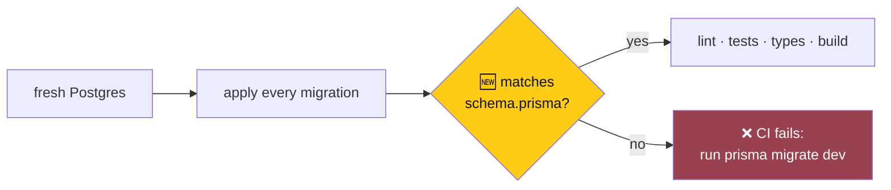

# Backend CI: hardening and a migration check

> **Owner:** [@nicolasrufino](https://github.com/nicolasrufino) · **Last reviewed:** Sep 29, 2026 · **Audience:** LOGICA members · **Type:** Change note
>
> **PR:** [backend#67](https://github.com/uic-logica/backend/pull/67) · **Issue:** [backend#66](https://github.com/uic-logica/backend/issues/66)

## Why

CI applied all 19 migrations to a fresh database but never checked that the result matched `schema.prisma`. If someone edits the schema and forgets `prisma migrate dev`, CI stays green and production breaks on the first request that touches the new field. In October, teams will start editing the schema.

## What changes

| Change | What it means for you |
|---|---|
| 🆕 **Migration check** | CI fails if `schema.prisma` has a change with no migration. Fix: `npx prisma migrate dev --name <what>` and commit the folder |
| New push cancels the old run | Pushing twice doesn't run CI twice |
| Read-only tokens (keepalive gets none) | A bad step can't write to the repo |
| Actions pinned by commit hash | `checkout` and `setup-node` can't change underneath us |
| `.node-version` (24.21.0) | CI and your laptop run the same Node |
| Dependabot, weekly and grouped | At most 3 update PRs a week for npm, 1 for Actions |

The check was tested on a throwaway Postgres. It exits `0` when in sync and `2` after adding a model with no migration.

**Not changed:** the job is still named `lint`, because branch protection requires that name. Production migrations are still run by hand ([#42](https://github.com/uic-logica/backend/issues/42)), as the README describes.

## Still open

Automating production migrations (#42) is the software lead's decision, because it changes how production deploys. The proposed shape is a separate workflow gated by a GitHub `production` environment with a required reviewer, running `migrate status` and then `migrate deploy`. It would never run inside the Vercel build.
