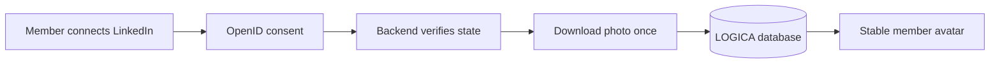

# Backend: LinkedIn profile photo connection

> **Owner:** [@nicolasrufino](https://github.com/nicolasrufino) · **Last reviewed:** Sep 29, 2026 · **Audience:** LOGICA members · **Type:** Change note
>
> **PR:** backend#TBD

## Why

Members currently paste a LinkedIn URL, but every dashboard avatar remains initials. LinkedIn photo URLs also expire, so displaying the provider URL directly would eventually leave broken avatars.

## What changes

| Change | What it means for you |
|---|---|
| LinkedIn OpenID Connect | A signed-in member can grant only `openid profile email` access |
| Local photo copy | The image remains available after LinkedIn's temporary URL expires |
| No stored access token | LOGICA discards the token after reading the user info and photo |
| Remove-photo endpoint | Members can disconnect the copied identity and image |

## Not done

Experience and employment history are not imported because LinkedIn's OpenID Connect user-info response does not provide them. Production migration and Vercel environment setup remain manual release steps.
