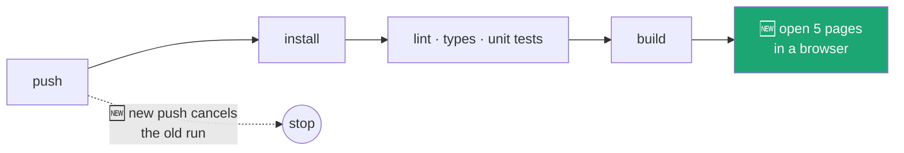

# Frontend CI: hardening and smoke tests

> **Owner:** [@nicolasrufino](https://github.com/nicolasrufino) · **Last reviewed:** Sep 29, 2026 · **Audience:** LOGICA members · **Type:** Change note
>
> **PR:** [frontend#94](https://github.com/uic-logica/frontend/pull/94) · **Issue:** [frontend#93](https://github.com/uic-logica/frontend/issues/93)

## Why

A CI review on Sep 29 found CI fast enough (about 45 seconds) but loose. It wasted runs, trusted tags that can change, and never opened a real page in a browser. With teams starting in October, more people will be pushing, so this is the time to tighten it.

## What changes



| Change | What it means for you |
|---|---|
| New push cancels the old run | Pushing twice doesn't run CI twice |
| Workflow token is read-only | A bad step can't write to the repo |
| Actions pinned by commit hash | `checkout` and `setup-node` can't change underneath us |
| `.node-version` (24.21.0) | CI and your laptop run the same Node. Use `nvm use` or `fnm use` |
| Dependabot, weekly and grouped | At most 3 update PRs a week for npm, 1 for Actions |
| Playwright smoke tests (`e2e/`) | `/`, `/events`, `/join`, `/signin`, `/signup` must load with no backend running |

**Cost:** the browser install and tests add about 30 seconds to each run.

**Not changed:** the job is still named `lint`, because branch protection requires that name.

## Run it yourself

```bash
npm run build
npx playwright install chromium   # once
npx playwright test
```

## Not done, and why

Parallel jobs, a build cache, and dropping the CI build were all measured and skipped. Each would save a few seconds at most, and dropping the build would remove the check that blocks broken merges. The review with the timings is in the CI review page.
