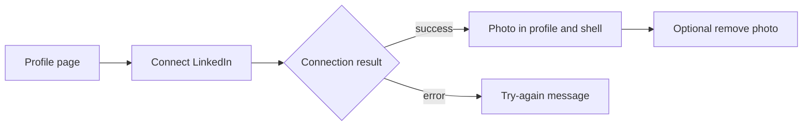

# Frontend: Connect LinkedIn profile photo

> **Owner:** [@nicolasrufino](https://github.com/nicolasrufino) · **Last reviewed:** Sep 29, 2026 · **Audience:** LOGICA members · **Type:** Change note
>
> **PR:** frontend#TBD

## Why

The profile form implied that pasting a LinkedIn URL imported a photo and experience, but it did neither. Members need an explicit connection flow and a reliable initials fallback.

## What changes

| Change | What it means for you |
|---|---|
| Connect button and status | The profile page clearly shows whether the connection worked |
| Photo avatars | Profile card, overview, top bar, and sidebar show the copied photo |
| Initials fallback | Accounts without a photo keep the existing avatar behavior |
| Truthful LinkedIn hint | The pasted URL remains, without claiming experience is imported |

## Not done

Other members' directory avatars are unchanged in this first pass. LOGICA does not import LinkedIn experience or continuously synchronize photos; reconnecting refreshes the stored copy.
