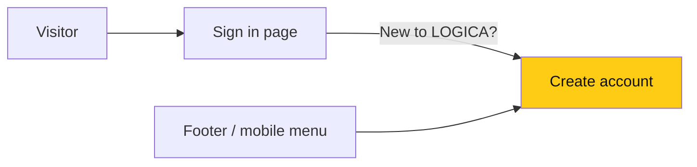

# Frontend: make sign-up easy to find

> **Owner:** [@nicolasrufino](https://github.com/nicolasrufino) · **Last reviewed:** Sep 29, 2026 · **Audience:** LOGICA members · **Type:** Change note
>
> **PR:** frontend#101

## Why

New members landed on Sign in and were told to ask the exec board for a password, even though `/signup` lets anyone with a UIC email create an account. Nothing pointed there.

## What changes

| Change | What it means for you |
|---|---|
| Sign-in page links to sign-up | New members find account creation in one click |
| "Create account" in footer and mobile menu | Reachable from every public page |
| Footer "Join" → "Join the team" | Clearer that it's the membership application |

## Not done

The desktop top bar still shows only **Sign in**; adding a second button there is a design call.
