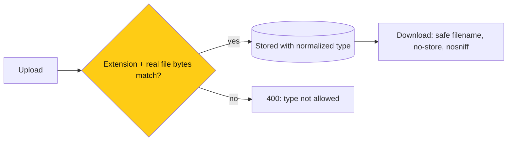

# Backend: safer uploads, downloads and writes

> **Owner:** [@nicolasrufino](https://github.com/nicolasrufino) · **Last reviewed:** Sep 30, 2026 · **Audience:** LOGICA members · **Type:** Change note
>
> **PR:** backend#76 · also: Google Search Console set up (no PR)

## Why

A codebase audit found the server trusted whatever file type the browser claimed, file names could break downloads, resumes could stay cached after logout, a failed notification could cause duplicate posts, and posts/forms had no size limit.

## What changes

| Change | What it means for you |
|---|---|
| Real file-type check | Resumes: PDF/DOCX/DOC. Materials: PDF/PPTX/PPT/DOCX/PNG/JPEG. Renamed files are refused |
| Safe download names | Quotes or accents in a filename can't break the download |
| `no-store` on resumes/materials | Nothing stays in a shared computer's cache |
| Best-effort notifications | A notification hiccup no longer errors after your post is saved |
| Size limits | Posts ≤ 5,000 characters, form answers ≤ 50 KB |
| Google Search Console | logicauic.org verified (DNS TXT in Cloudflare), sitemap submitted, home page indexing requested |

## Not done

Event materials used to accept any file; ask if the board needs more types (e.g. `.xlsx`).
