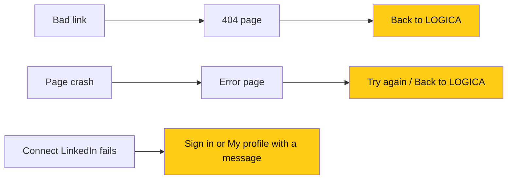

# Error pages and no more raw JSON

> **Owner:** [@nicolasrufino](https://github.com/nicolasrufino) · **Last reviewed:** Sep 30, 2026 · **Audience:** LOGICA members · **Type:** Change note
>
> **PRs:** frontend#103 · backend#73

## Why

A broken link or crash showed the default Next.js screen, and Connect LinkedIn errors showed raw JSON on a black page. Neither gave people a way back.

## What changes

| Change | What it means for you |
|---|---|
| `not-found.tsx` | Mistyped or old links land on a styled 404 with a way home |
| `error.tsx` | A crash shows Try again and Back to LOGICA |
| `global-error.tsx` | Even a broken root layout gets a recovery page |
| Connect route redirects | Signed out → sign in; not configured → My profile with an error message |

## Not done

Other API routes still answer with JSON; they're called by `fetch`, not opened in the browser, so they don't need pages.
