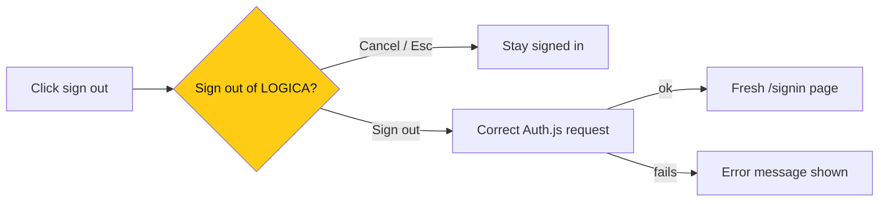

# Frontend: sign-out that works every time

> **Owner:** [@nicolasrufino](https://github.com/nicolasrufino) · **Last reviewed:** Sep 30, 2026 · **Audience:** LOGICA members · **Type:** Change note
>
> **PR:** frontend#106

## Why

Clicking sign out sometimes did nothing. The request used an outdated Auth.js format, so a CSRF rejection looked like success and no error was shown. Members also asked for a confirmation before signing out.

## What changes

| Change | What it means for you |
|---|---|
| Confirmation dialog | No accidental sign-outs; Cancel is the default |
| Correct request + response check | Sign-out works, or tells you it didn't |
| Double-click guard | One click, one sign-out |
| Full page reload after sign-out | Back can't show the old dashboard |

## Not done

Couldn't reproduce the original silent failure live; the fix targets every failure path found in the code.
