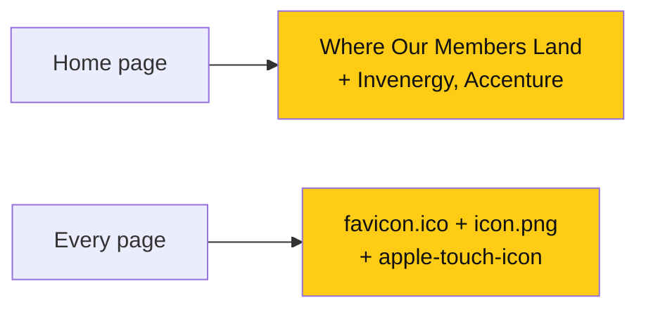

# Home logos and favicon

> **Owner:** [@nicolasrufino](https://github.com/nicolasrufino) · **Last reviewed:** Sep 30, 2026 · **Audience:** LOGICA members · **Type:** Change note
>
> **PRs:** frontend#104 · frontend#105

## Why

Members now land at Invenergy and Accenture, and the home page didn't show it. Separately, Safari showed a letter placeholder instead of the LOGICA logo in the tab, because the site only shipped a `.ico` file.

## What changes

| Change | What it means for you |
|---|---|
| Invenergy and Accenture logos | Official wordmarks, text turned white for the night background, brand accents kept |
| `icon.png` (256px) | Safari and modern browsers show the LOGICA logo in the tab |
| `apple-icon.png` (180px) | iPhone home-screen bookmarks show the logo |

## Not done

84.51° for Company Visits is waiting on a logo file; their site blocks automated downloads.
