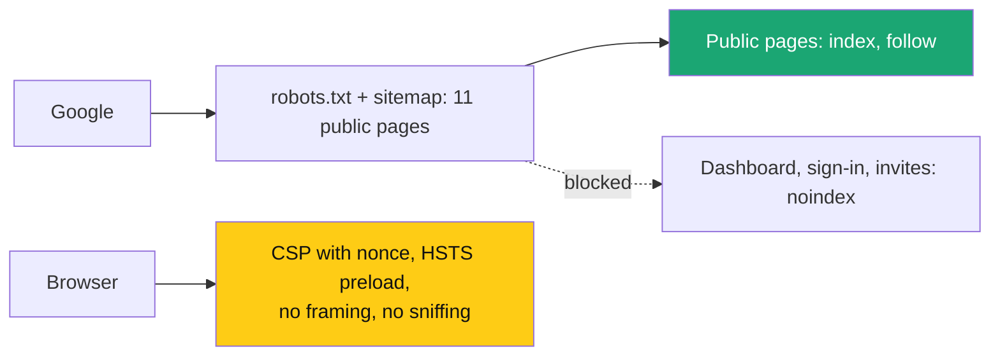

# SEO and security hardening

> **Owner:** [@nicolasrufino](https://github.com/nicolasrufino) · **Last reviewed:** Sep 30, 2026 · **Audience:** LOGICA members · **Type:** Change note
>
> **PRs:** frontend#107 · backend#74 · frontend#108

## Why

Every page told Google **not to index it** (a missing `SITE_URL` flipped `robots` to `noindex`), the sitemap was empty, and the site sent none of the security headers graders check. Lighthouse SEO was 66.

## What changes

| Area | Before | After |
|---|---|---|
| Indexing | `noindex` everywhere | Public pages indexable; previews + private pages `noindex` |
| Sitemap | empty | 11 public pages on logicauic.org |
| Lighthouse SEO | 66 | 100 (local production build) |
| Security headers | HSTS only | CSP (nonce), HSTS preload, X-Frame-Options, nosniff, Referrer-Policy, Permissions-Policy, COOP |
| Extras | — | Web manifest, `/.well-known/security.txt`, Event structured data, self-hosted fonts |
| SSL | Vercel / Let's Encrypt, auto-renewed | unchanged (already A-grade) |
| Favicon (frontend#108) | black square | round white LOGICA badge, same as the dashboard |

## Not done (needs a person)

Submit the sitemap in Google Search Console, re-run securityheaders.com / Mozilla Observatory after deploy, and optionally submit to hstspreload.org.
