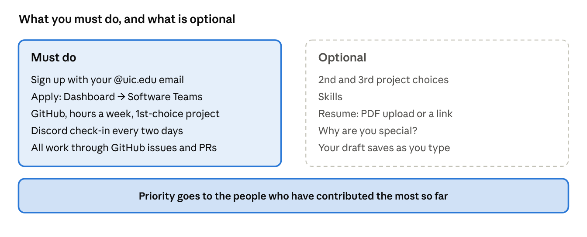
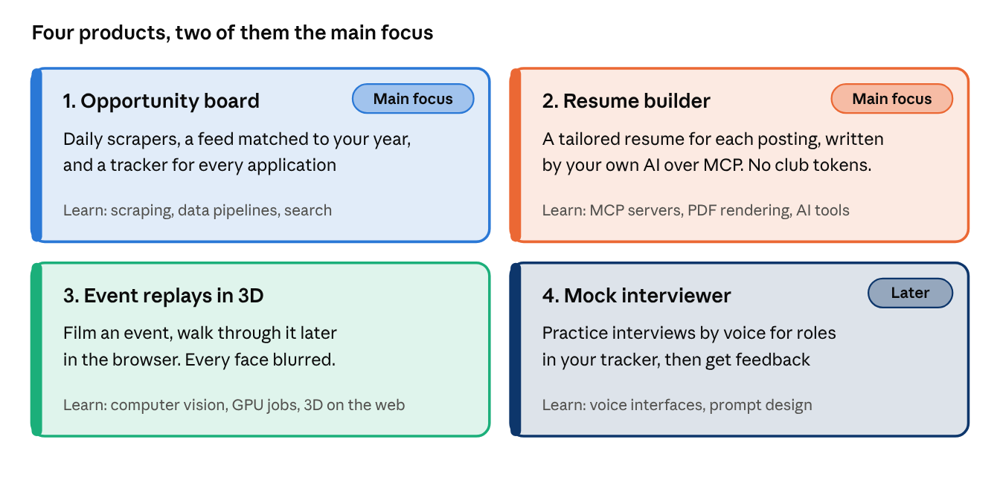
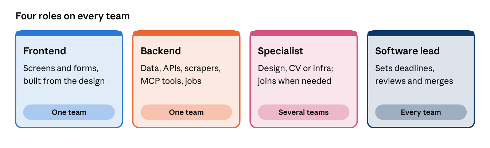
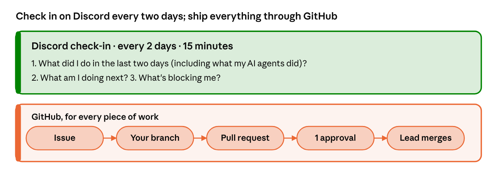
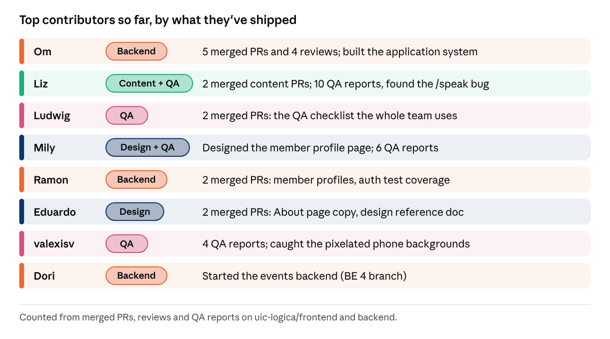
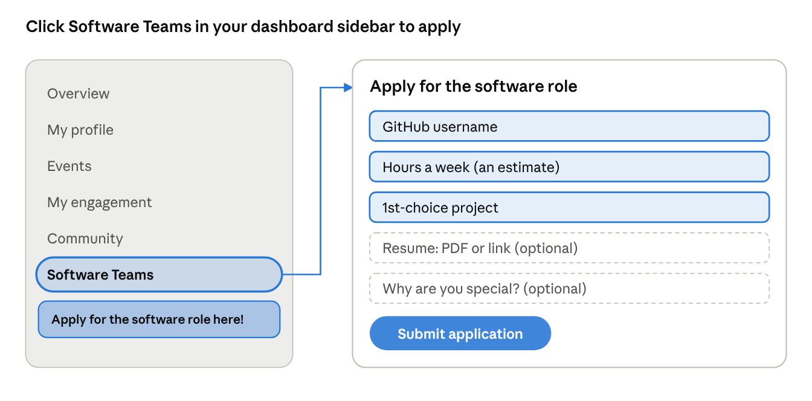
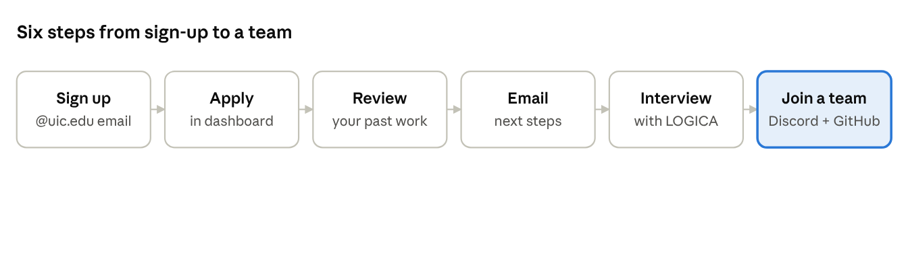

# LOGICA Software Teams — Fall 2026

> **Owner:** [@nicolasrufino](https://github.com/nicolasrufino) · **Last reviewed:** Sep 29, 2026 · **Audience:** LOGICA members · **Type:** Conceptual

> Starting October 2026, LOGICA @ UIC builds software as **product teams**. Each team owns one product that helps students get hired. Everything is open source.
> Software lead: **Nicolas Rufino** ([@nicolasrufino](https://github.com/nicolasrufino)). Live version of this doc: [Claude Docs](https://claude.ai/code/artifact/e34dd50c-29af-4f88-97b2-bd90e0c6f4fd).

## Why

| For members | For the club |
|---|---|
| A public record of real team work (issues, PRs, reviews) to show employers | Products members actually use in their job search |
| Tools people hire for: CV, scrapers, AI over MCP, full-stack web | A repeatable way to run software work, visible to anyone |

Unpaid. What you get is the work, the experience and the public record.

## The four products

| # | Product | What it does | Status |
|---|---|---|---|
| 1 | **Opportunity board** | Daily scrapers (Greenhouse, Lever, Ashby, community lists) → a feed matched to your class year → a tracker (Applied → OA → Interview → Offer) | Main focus |
| 2 | **Resume builder** | One proven one-page template; your own AI tailors it per posting through our MCP tools (`get_profile`, `get_posting`, `get_template`, `render_resume`). No club tokens. Keyword check with no AI. | Main focus |
| 3 | **Event replays in 3D** | Phone video → frames → camera poses → 3D scene on a rented GPU → browser viewer. Faces blurred first. | Next |
| 4 | **Mock interviewer** | Voice practice for roles in your tracker, with feedback, via MCP | Later |

## Roles

Pick your hours honestly when you apply. A steady 4 hours beats a promised 15.

## How we work

- Every piece of work starts as an issue, labeled with its team (`team: opportunity-board`, …).
- Branch as `<yourname>/<short-description>`. Nobody pushes to `main`.
- Every change is a PR with passing lint and one approval. The lead merges.
- Decisions and designs are written down in the repo, not only on Discord.

## Top contributors so far

**The people who have contributed the most get priority when we place teams.** Placement: contributions first, then the application and a short interview.

## How to join

1. Create an account at [the LOGICA site](https://logicauic-logica5.vercel.app/signup) with your **@uic.edu** email.
2. Dashboard → **Software Teams** (a gold note points to it).
3. Required: GitHub username, hours a week (an estimate), 1st-choice project. Optional: 2nd/3rd choices, skills, resume (PDF or link), "Why are you special?". Drafts save as you type.
4. We review it with the work you've already done. Only the exec board sees applications.
5. Email → short interview with LOGICA → placed on a team (Discord channel + GitHub issues).
