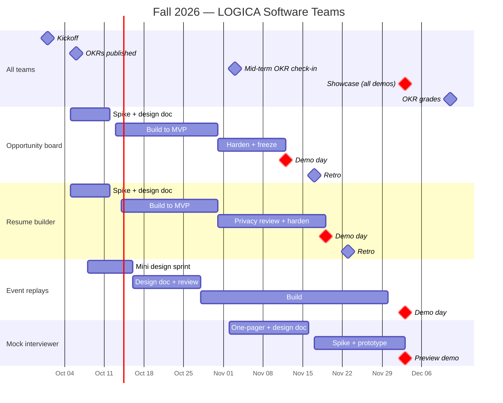
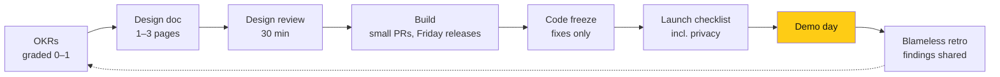

# How we run projects

> **Owner:** [@nicolasrufino](https://github.com/nicolasrufino) · **Last reviewed:** Sep 29, 2026 · **Audience:** Members and recruiters · **Type:** Conceptual

## Fall 2026 at a glance

## The cycle every project runs

| Practice | Our version | From Google |
|---|---|---|
| **OKRs** | 1–2 objectives, ~3 key results, graded 0.0–1.0 in the repo. Committed = 1.0 expected; aspirational ≈ 0.7 | re:Work OKR guide; Google's OKR playbook |
| **Design doc** | 1–3 pages: context, goals and non-goals, design, alternatives, privacy/security. Reviewed by the lead + one person from another team | "Design docs at Google" |
| **Small PRs, fast review** | Aim under ~300 lines; reviewers answer within 48 h; optional comments start with `Nit:` | Google eng-practices |
| **Release train** | Merged work ships every Friday from Oct 23; tag a GitHub Release | *Software Engineering at Google*, ch. 24 |
| **Code freeze** | 3–4 days before each demo, fixes only | Launch practice |
| **Launch checklist** | ~12 boxes incl. privacy (resumes, LinkedIn, MCP tokens) | SRE book, "Reliable product launches" |
| **Weekly snippet** | One status file per team every Monday; Discord check-ins every 2 days stay | Google Snippets |
| **Demo day** | One per team, staggered, writeup + slides + video in the repo | TGIF demos |
| **Blameless retro** | Within 5 days of the demo: what went well, what went wrong, where we got lucky, findings, owned actions | SRE book, postmortem culture |
| **Design sprint** | Two sessions instead of five days (Event replays) | GV Sprint |

**Skipped on purpose:** readability certification, OWNERS approvals, launch coordination engineers, capacity planning, 20% time — too heavy for 13 volunteers.

## Words we use

| Word | Plain meaning |
|---|---|
| **OKR** | Objectives and key results: what the team wants to achieve and 2–3 numbers that prove it. Graded 0.0–1.0 at the end |
| **Committed / aspirational** | Committed means we must hit it (1.0). Aspirational means a stretch goal; about 0.7 is a good result |
| **Design doc** | A 1–3 page plan written before building: the problem, the approach, and what else we considered |
| **Spike** | A short experiment (about a week) to prove the hardest part works before building the rest |
| **MVP** | Minimum viable product: the smallest version members can try |
| **Release train** | Whatever is merged by Friday ships that Friday, every week |
| **Code freeze** | A few days before a demo, only bug fixes get merged |
| **Launch checklist** | The boxes a project checks before going public, including privacy and security |
| **Demo day** | The team presents what it built; the writeup, slides and video go in the repo |
| **Blameless retro** | A look back after the demo: what worked, what didn't, what we learned. It fixes processes, not people |

## Where things live

| Thing | Where |
|---|---|
| A project's plan, OKRs, design doc, status, demos, retro | [`projects/<team>/`](../../projects/README.md) |
| Due dates and progress bars | GitHub milestones in [frontend](https://github.com/uic-logica/frontend/milestones) and [backend](https://github.com/uic-logica/backend/milestones) |
| Shipped code | GitHub Releases, every Friday |

## Sources

[re:Work — Set goals with OKRs](https://rework.withgoogle.com/intl/en/guides/set-goals-with-okrs) · [Google OKR playbook](https://www.whatmatters.com/resources/google-okr-playbook) · [Design docs at Google](https://www.industrialempathy.com/posts/design-docs-at-google/) · [SRE: postmortem culture](https://sre.google/sre-book/postmortem-culture/) · [SRE: reliable product launches](https://sre.google/sre-book/reliable-product-launches/) · [SWE at Google: code review](https://abseil.io/resources/swe-book/html/ch09.html) · [SWE at Google: continuous delivery](https://abseil.io/resources/swe-book/html/ch24.html) · [eng-practices: small CLs](https://google.github.io/eng-practices/review/developer/small-cls.html) · [eng-practices: review speed](https://google.github.io/eng-practices/review/reviewer/speed.html) · [GV Sprint](https://www.gv.com/sprint/)
