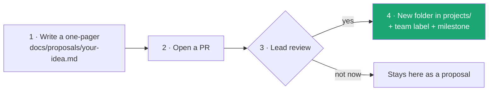

# Propose a project

> **Owner:** [@nicolasrufino](https://github.com/nicolasrufino) · **Last reviewed:** Sep 29, 2026 · **Audience:** LOGICA members · **Type:** Tutorial

Have an idea that isn't one of the [current projects](../../projects/README.md)? Propose it. Members only.



## The one-pager

Copy this into `docs/proposals/<your-idea>.md` and keep it under one page:

```markdown
# <Idea>
**Proposed by:** <your name> · **Date:** <Mon DD, YYYY>

## Problem and who it helps
## What you'd build (3–5 bullets)
## Rough stack and size (hours a week, people)
## Why now
```

If it's accepted, the lead creates `projects/<idea>/` from the same files every project uses, and you're credited as the proposer.
