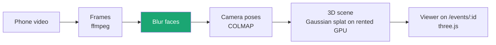

# 🟢 Event replays in 3D

**Label:** `team: event-replays` · **Priority:** next · **Lead:** Nicolas Rufino

Film an event on a phone; anyone can walk through it later on the event page. **Every face is blurred before anything is published.**

| Milestone | Done when | Area |
|---|---|---|
| 1. Spike | One empty-room scene opens in the browser | CV |
| 2. Pipeline | Upload → GPU job → scene file stored with the event | Backend |
| 3. Viewer | Event page shows the scene, works on phones | Frontend |

**Camera rules:** no face matching, faces blurred, a sign at any event we capture.
**You learn:** computer vision, GPU jobs, 3D on the web.
