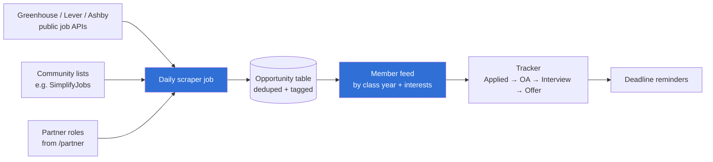

# 🔵 Opportunity board

**Label:** `team: opportunity-board` · **Priority:** main focus · **Lead:** Nicolas Rufino

Every internship and new-grad role worth applying to, always current, filtered to what each member can actually get — plus a tracker for every application.

| Milestone | Done when | Area |
|---|---|---|
| 1. Spike | One scraper pulls one company's board into a local table, deduped | Backend |
| 2. Data model | `Opportunity` with tags (year, field, location, sponsorship, deadline) + migration | Backend |
| 3. Daily job | Scheduled job refreshes all sources; closed roles drop off | Backend |
| 4. Feed | Dashboard tab shows roles matched to the member's year | Frontend |
| 5. Tracker | Members move applications through stages; reminders fire before deadlines | Full-stack |

**Rules:** public APIs and lists only — no scraping sites whose terms forbid it (LinkedIn, Indeed, Handshake).
**You learn:** scraping, scheduled jobs, data pipelines, search.
