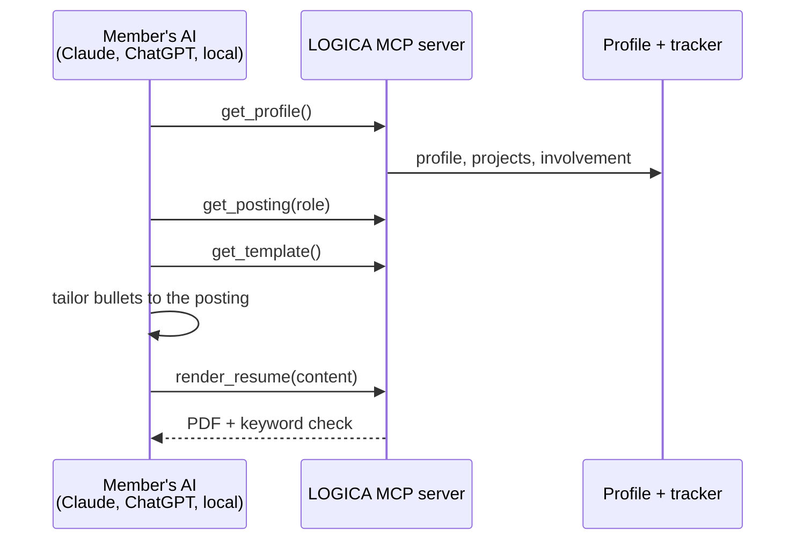

# 🟠 Resume builder

**Label:** `team: resume-builder` · **Priority:** main focus · **Lead:** Nicolas Rufino

A resume tailored to each posting, from one proven template. **Members' own AI does the writing through our MCP tools**, so the club pays for no tokens.

| Milestone | Done when | Area |
|---|---|---|
| 1. Spike | One template renders to PDF from a JSON résumé | Backend |
| 2. MCP tools | `get_profile`, `get_posting`, `get_template`, `render_resume` work from a real AI client | Backend |
| 3. Keyword check | Plain code lists posting terms missing from the resume (no AI) | Backend |
| 4. Resume page | Preview, versions per application, download | Frontend |

**Template:** one single-page layout recruiters already trust; bullets as "did X, measured by Y, by doing Z". No custom designs.
**You learn:** MCP servers, tool design for AI agents, PDF rendering.
