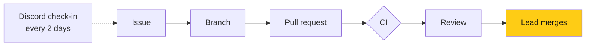

# LOGICA @ UIC

**Latinx and underrepresented students in computing at the University of Illinois Chicago.** We run the club on software we build ourselves, in the open.

**Software lead:** Nicolas Rufino · [@nicolasrufino](https://github.com/nicolasrufino) — owns every product, sets the deadlines, reviews and merges.

[**Live site**](https://logicauic-logica5.vercel.app) · [Roadmap](https://github.com/uic-logica/.github/blob/main/ROADMAP.md) · [How we work](https://github.com/uic-logica/.github/blob/main/CONTRIBUTING.md)

| 74 | 71 | 13 | 5 weeks |
|:--:|:--:|:--:|:--:|
| merged PRs | closed issues | members | from kickoff to a live site |

---

## For recruiters

**What we've shipped (Aug–Sep 2026):** a full club platform — public site, @uic.edu accounts, a member dashboard, an exec workspace (money, outreach, insights, applications), speaker intake with an availability calendar, and a night redesign across all of it.

**What we're building next (Fall 2026):** four products that help students get hired, one team each.

| | Product | The hard part |
|:--:|---|---|
| 🔵 | **Opportunity board** | Daily scrapers → a feed matched to class year → an application tracker |
| 🟠 | **Resume builder** | Members' own AI tailors a proven template through our MCP tools — zero club token cost |
| 🟢 | **Event replays in 3D** | Computer vision: phone video → Gaussian-splat scene in the browser, faces blurred |
| ⚪ | **Mock interviewer** | Voice practice for roles in the tracker, via MCP |

**Demo days, Fall 2026** — each writeup, slides and retro land in the repo as the project ships:

| Demo | Date | Writeup |
|---|---|---|
| 🔵 Opportunity board | Thu Nov 12 | [projects/opportunity-board/demos](https://github.com/uic-logica/.github/tree/main/projects/opportunity-board/demos) |
| 🟠 Resume builder | Thu Nov 19 | [projects/resume-builder/demos](https://github.com/uic-logica/.github/tree/main/projects/resume-builder/demos) |
| 🟢 Event replays · ⚪ Mock interviewer | Thu Dec 3 (showcase) | [projects](https://github.com/uic-logica/.github/tree/main/projects) |

Planned like Google, sized for students: OKRs, design docs and reviews, Friday releases, launch checklists, blameless retros — [how we run projects](https://github.com/uic-logica/.github/blob/main/docs/how-we-run-projects/README.md).

**How the team runs** — every change is public:

**Look at the work:**

| See | Where |
|---|---|
| A large feature, end to end | [frontend#88 — night redesign across site and dashboard](https://github.com/uic-logica/frontend/pull/88) |
| Backend + frontend shipped together | [backend#64](https://github.com/uic-logica/backend/pull/64) + [frontend#91](https://github.com/uic-logica/frontend/pull/91) — Software Teams applications |
| How work is planned | [Roadmap](https://github.com/uic-logica/.github/blob/main/ROADMAP.md) · [project folders](https://github.com/uic-logica/.github/tree/main/projects) |
| How people are placed on teams | [Software Teams — Fall 2026](https://github.com/uic-logica/.github/blob/main/docs/guides/software-teams-fall-2026.md) |

**Stack:** Next.js 16 · TypeScript · Tailwind · Prisma 7 · Postgres (Supabase) · Auth.js · Vercel · Vitest · GitHub Actions

---

## For LOGICA members

1. **Apply to a Software Team:** [dashboard → Software Teams](https://logicauic-logica5.vercel.app/dashboard/teams) (sign up with your @uic.edu email).
2. **Read how we work:** [CONTRIBUTING](https://github.com/uic-logica/.github/blob/main/CONTRIBUTING.md) — issue → branch → PR → review → merge.
3. **Find your team's work:** [project folders](https://github.com/uic-logica/.github/tree/main/projects) and issues labeled `team: …`.
4. **Set up locally:** [frontend](https://github.com/uic-logica/frontend#readme) · [backend](https://github.com/uic-logica/backend#readme) · [Claude Code skills](https://github.com/uic-logica/skills).

Contributions are **members only**.

| Repo | What |
|---|---|
| [frontend](https://github.com/uic-logica/frontend) | The site: public pages, dashboard, exec workspace |
| [backend](https://github.com/uic-logica/backend) | API, auth, database |
| [.github](https://github.com/uic-logica/.github) | Roadmap, workflow, team pages, documents |
| [skills](https://github.com/uic-logica/skills) | Claude Code commands for our workflow |

---

Owner: Nicolas Rufino · Last reviewed: Sep 29, 2026
