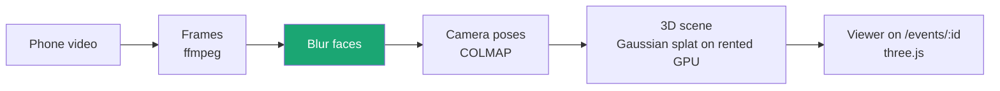
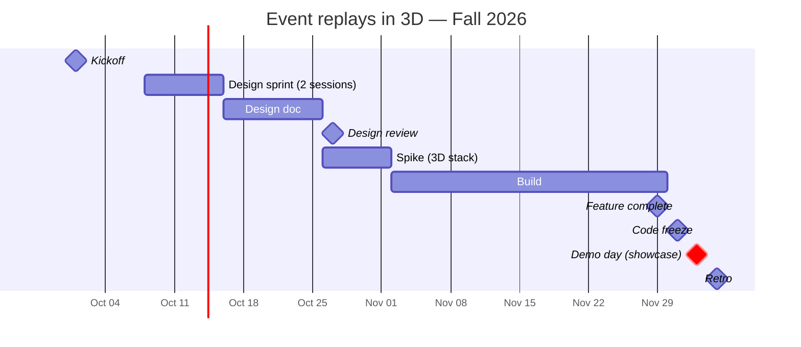

# Event replays in 3D

> **Owner:** [@nicolasrufino](https://github.com/nicolasrufino) · **Last reviewed:** Sep 29, 2026 · **Audience:** Members and recruiters · **Type:** Project page

**Label:** `team: event-replays` · **Priority:** next

Film an event on a phone; anyone can walk through it later on the event page. **Every face is blurred before anything is published.**

| Milestone | Done when | Area |
|---|---|---|
| 1. Spike | One empty-room scene opens in the browser | CV |
| 2. Pipeline | Upload → GPU job → scene file stored with the event | Backend |
| 3. Viewer | Event page shows the scene, works on phones | Frontend |

**Camera rules:** no face matching, faces blurred, a sign at any event we capture.
**You learn:** computer vision, GPU jobs, 3D on the web.

## Timeline — Fall 2026

New to these terms? See [words we use](../../docs/how-we-run-projects/README.md#words-we-use).

| Milestone | Date |
|---|---|
| Kickoff | Thu Oct 1 |
| Mini design sprint · session 1 (map + sketch) | Thu Oct 8 |
| Mini design sprint · session 2 (decide + prototype + test) | Thu Oct 15 |
| Design doc due | Sun Oct 25 |
| Design review | Tue Oct 27 |
| Spike (3D stack) | week of Oct 26 |
| Feature complete | Sun Nov 29 |
| Code freeze | Tue Dec 1 |
| **Demo day (showcase)** | **Thu Dec 3** |
| Retro | Sat Dec 5 |
| OKR grades | Fri Dec 11 |

## Artifacts

| File | What | Status |
|---|---|---|
| [okrs.md](okrs.md) | Objectives and key results, graded 0–1 | Due Tue Oct 6 |
| [design-doc.md](design-doc.md) | 1–3 page design doc | See timeline |
| [research.md](research.md) | Capture, formats, viewers, cost, privacy and v1 recommendation | Ready |
| [build-plan.md](build-plan.md) | Architecture, runbook, schedule, backlog, risks and tests | Ready |
| [status/](status/) | Weekly snippet every Monday | From Mon Oct 12 |
| [launch-checklist.md](launch-checklist.md) | Must pass before the public release | Before the demo |
| [demos/](demos/) | Demo day writeup, slides, video | 2026-12-03 |
| [retro.md](retro.md) | Blameless retro and findings | After the demo |
