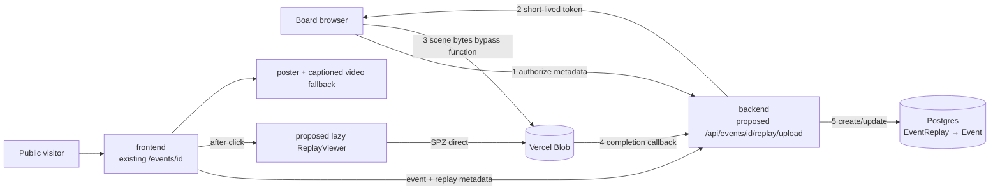

# Event replays in 3D — build plan

> **Owner:** [@nicolasrufino](https://github.com/nicolasrufino) · **Last reviewed:** Oct 1, 2026 · **Audience:** Event replays team · **Type:** Build plan

## Ship target

By **Thu Dec 3, 2026**, one consent-reviewed event has a phone-friendly 3D replay plus a captioned 2D fallback. The page works without loading 3D until the visitor asks.

Read [research.md](research.md) for the stack decision and evidence. All paths below marked **proposed** are new; the existing repo paths were verified Oct 1.

## Architecture



### What exists now

| Repo | Observed convention |
|---|---|
| `backend` | Next.js 16 route handlers under `app/api`; Prisma 7/Postgres; `Event`, `Attendance`, `EventMaterial`; `auth()` plus `accountKind === "MEMBER"` and `hasRole(..., "BOARD")`; Vitest node tests import handlers and mock auth/Prisma |
| `frontend` | Next.js 16, React 19, Tailwind 4; `/events` server-fetches and revalidates; `/events/[id]` is a client page using `api()` through `/api`; Vitest plus Playwright smoke tests against `next start`; GSAP installed |

### Data model — proposed

One published replay per event keeps v1 small. Store bytes in Blob, metadata in Postgres.

```prisma
enum ReplayStatus {
  DRAFT
  READY
  PUBLISHED
  FAILED
}

model EventReplay {
  id               String       @id @default(cuid())
  eventId          String       @unique
  uploadedById     String
  status           ReplayStatus @default(DRAFT)
  sceneUrl          String?
  scenePathname     String?
  sceneBytes        Int?
  sceneFormat       String?
  posterUrl         String?
  fallbackVideoUrl String?
  consentReviewedAt DateTime?
  createdAt         DateTime     @default(now())
  updatedAt         DateTime     @updatedAt

  event      Event @relation(fields: [eventId], references: [id], onDelete: Cascade)
  uploadedBy User  @relation(fields: [uploadedById], references: [id], onDelete: Restrict)
}
```

Add `replay EventReplay?` to `Event` and `uploadedReplays EventReplay[]` to `User` (**proposed**). Prefer an enum for status; validate `sceneFormat` to `spz` in the route. Do not put scene bytes in `EventMaterial.data`.

### API — proposed

| Route | Access | Contract |
|---|---|---|
| `POST /api/events/[id]/replay/upload` | MEMBER account, BOARD+ | Validate event and filename/size/type; return a Vercel Blob client-upload token scoped to `event-replays/<eventId>/...`; callback verifies pathname and records URL/bytes/format as `READY` |
| `PATCH /api/events/[id]/replay` | MEMBER account, BOARD+ | Publish only when scene, poster/fallback, and `consentReviewedAt` exist; allow unpublish and metadata replacement |
| `GET /api/events/[id]/replay` | Public | Return only `PUBLISHED` metadata; otherwise 404. Never expose raw/private capture URLs |
| `DELETE /api/events/[id]/replay` | MEMBER account, BOARD+ | Unpublish first, delete Blob objects, then delete metadata; log failure and remain unpublished if object deletion fails |

Reuse the existing board-account pattern from `app/api/events/[id]/materials/route.ts` and `hasRole` from `lib/authz.ts`. The current event detail endpoint selects the raw `Event`; either add a narrow `replay` select there or let the frontend call the dedicated public route. The dedicated route is easier to test and cache.

**Upload rules:** direct client upload only; no base64; `.spz` scene only; server-selected pathname; declared maximum 100 MB while the ship target remains 50 MB `(verify)`; reject overwrite unless explicitly replacing the event’s draft; verify callback metadata rather than trusting the browser. Vercel’s documented 4.5 MB function body cap makes proxy uploads invalid.

### Frontend — proposed

| Piece | Location | Behavior |
|---|---|---|
| Replay section | extend existing `src/app/events/[id]/page.tsx` | Fetch replay metadata after event; show poster, size, fallback, and load action |
| `ReplayViewer` | `src/app/events/[id]/ReplayViewer.tsx` | Client-only dynamic import of PlayCanvas; fetch scene only after click; dispose on unmount |
| `ReplayFallback` | `src/app/events/[id]/ReplayFallback.tsx` | Captioned video/photo and text link; always available without WebGL |
| Board upload panel | extend event detail or proposed child component | Direct upload progress, consent-review checkbox, preview, publish/unpublish/delete |

Do not import the renderer in the initial bundle. Show `Load 3D replay (42 MB)` and a cellular-data warning. Canvas controls: orbit/touch, keyboard arrows or documented keys, reset view, pause, and exit. Respect reduced motion and provide a non-canvas path.

## Capture-day runbook

### Pack and prepare

- [ ] Named capture owner and privacy reviewer
- [ ] Tested supported phone; ≥ 10 GB free space `(verify)`; battery full; power bank
- [ ] Scaniverse signed in and export tested the day before
- [ ] Tripod/gimbal optional; lens cloth; backup phone
- [ ] Printed signs at registration and every entrance: purpose, public destination, opt-out contact
- [ ] Host announcement script; clearly marked no-camera area and route
- [ ] Written releases ready for anyone intentionally featured
- [ ] Empty-room capture window reserved before doors open
- [ ] Shot list: full room loop, stage/details, fallback photos, 2D video

### Capture

- [ ] Announce recording and point out the no-camera zone
- [ ] Capture the empty room first; remove badges, private screens, QR/check-in codes, and whiteboard notes
- [ ] Keep lighting stable; avoid mirrors and moving displays
- [ ] Walk slowly in one continuous loop, then overlapping interior passes; do not whip-pan
- [ ] Keep a stable distance from walls/objects and revisit textured landmarks
- [ ] If people are included, use only released participants; ask them to remain still
- [ ] Record a separate short 2D fallback and ambient-free narration; capture poster photo
- [ ] Review footage on site; repeat before the room changes if blur, exposure, or coverage fails

### Handoff and privacy gate

- [ ] Copy raw files to the restricted working location; do not post to Discord/public drives
- [ ] Record phone/app/version, duration, route, lighting, and known problems
- [ ] Verify opt-outs and releases against every visible person
- [ ] Blur/remove faces, badges, screens, and bystanders **before** third-party upload; if impossible, use empty-room capture
- [ ] Process a draft; inspect the final splat from multiple angles for reconstructed identities
- [ ] Generate SPZ, poster, captioned MP4, captions/transcript, and checksums
- [ ] Second person signs off consent/privacy; set `consentReviewedAt`
- [ ] Upload draft, preview on physical phones, then publish
- [ ] Apply the agreed raw retention/deletion policy `(verify)` and record deletion

## Schedule

| Dates | Existing milestone | Deliverable |
|---|---|---|
| Thu Oct 1 | Kickoff | Assign capture, frontend, backend, QA owners; confirm devices and consent-review owner |
| Oct 8–15 | Mini design sprint | Test capture on two phones; compare Scaniverse exports; paper-test viewer/fallback; decide privacy copy |
| Oct 16–27 | Design doc + review | Approve SPZ/PlayCanvas/Blob architecture, schema, upload threat model, capture consent, size/device budgets |
| Oct 28–Nov 1 | Build week 1 | Empty-room golden asset; schema migration; public replay read contract |
| Nov 2–8 | Build week 2 | Authorized direct upload and callback; unit tests |
| Nov 9–15 | Build week 3 | Lazy viewer, poster, fallback, loading/error states |
| Nov 16–22 | Build week 4 | Board publish flow; real capture; privacy review; Playwright path |
| Nov 23–29 | Build week 5 | Physical-device performance, accessibility, deletion drill, docs; feature complete Sun Nov 29 |
| Nov 30–Dec 1 | Hardening / existing code freeze Tue Dec 1 | Fix only; launch checklist; rehearse offline fallback |
| Thu Dec 3 | Demo day | Live 3D replay plus captioned 2D backup |

## Issue-ready backlog

Dependencies use task numbers; `—` means none.

| # | Title | Area | Size | Acceptance criteria | Dependencies |
|---:|---|---|:---:|---|---|
| 1 | Capture an empty-room golden dataset | Capture | S | Consent-safe phone capture, poster, and notes stored privately; app/phone/duration documented | — |
| 2 | Compare Scaniverse PLY and SPZ exports | Capture | S | Both exports measured; visual defects logged; one checked-in metadata note names chosen source format, not raw media | 1 |
| 3 | Trim and compress the golden scene in SuperSplat | Capture | M | Cropped SPZ opens in local viewer, target ≤ 50 MB or exception documented, no recognizable personal data | 2 |
| 4 | Write capture signage and host announcement | Capture | S | Copy states purpose, public use, opt-out contact/zone; lead/privacy reviewer approves | — |
| 5 | Add EventReplay Prisma model and migration | Backend | M | Proposed model/relations migrate cleanly; Prisma generation and typecheck pass; one replay per event enforced | — |
| 6 | Add public replay metadata route | Backend | S | Published replay returns narrow JSON; draft/missing returns 404; route tests cover both | 5 |
| 7 | Add board-authorized Blob upload token route | Backend | L | Signed-out 401, member/speaker 403, board+ allowed; pathname scoped by event; type/size validated; no bytes cross function | 5 |
| 8 | Persist and verify Blob completion callback | Backend | M | Callback rejects wrong pathname/type/event; valid completion records URL, pathname, byte count and `READY` | 7 |
| 9 | Add publish/unpublish endpoint and privacy gate | Backend | M | Cannot publish without scene, fallback/poster and consent timestamp; board+ only; tests cover transitions | 5, 8 |
| 10 | Add replay deletion endpoint | Backend | M | Unpublishes first; deletes all known objects and row; partial failure stays nonpublic and returns actionable error | 5, 8 |
| 11 | Add replay metadata client types and fetch state | Frontend | S | Event detail handles published, missing, loading and API-error cases without hiding event content | 6 |
| 12 | Build poster-first replay card | Frontend | S | Poster, scene size, “Load 3D” button, fallback link and cellular warning render responsively | 11 |
| 13 | Integrate lazy PlayCanvas viewer | Frontend | L | Viewer JS and SPZ fetch start only after click; scene renders; resources dispose on exit/unmount | 3, 12 |
| 14 | Add touch, keyboard, reset and pause controls | Frontend | M | Controls work without pointer-only gestures; visible help; no keyboard trap; reduced motion disables automatic movement | 13 |
| 15 | Add viewer loading, timeout and WebGL failure states | Frontend | S | Progress is announced; errors retain poster and offer fallback/retry; event text remains usable | 13 |
| 16 | Build board direct-upload panel | Frontend | L | Board selects SPZ/poster/fallback, sees progress, uses client upload token, and cannot publish before privacy gate | 7, 8, 9 |
| 17 | Add captioned 2D fallback | Frontend | M | MP4 has captions; poster has useful alt; transcript/summary link present; usable with JS/viewer failure | 12 |
| 18 | Unit-test replay permissions and validation | QA | M | Vitest covers 401/403/404, speaker-with-board-role denial, filename/type/size/path validation, and happy path | 6–10 |
| 19 | Add Playwright replay smoke test | QA | M | Production build test opens event, confirms no scene request before click, loads fixture after click, and reaches fallback | 12–17 |
| 20 | Test physical-phone performance matrix | QA | M | iPhone Safari and mid-range Android Chrome results record page load, scene load, FPS/crash outcome and defects `(verify)` | 13–17 |
| 21 | Run privacy review on final scene | QA | S | Two-person inspection covers faces/badges/screens/whiteboards from multiple angles; sign-off timestamp recorded | 3, 17 |
| 22 | Run accessibility and reduced-motion pass | QA | S | Keyboard, screen-reader labels, focus, contrast, captions and reduced motion checked; defects filed | 14, 15, 17 |
| 23 | Run unpublish/delete recovery drill | QA | S | Public endpoint stops serving immediately; objects removed; failure behavior and operator steps recorded | 10, 16 |
| 24 | Capture and publish the demo event | Capture | L | Runbook completed; consent evidence and privacy sign-off recorded; replay + fallback published and phone-tested | 4, 16, 20–22 |

### Good first issues

| Issue | Why |
|---|---|
| #4 Capture signage and host announcement | Small, concrete privacy work; no codebase setup |
| #11 Replay metadata client states | Teaches the existing `api()` and event page without WebGL |
| #12 Poster-first replay card | Bounded responsive UI with explicit states |
| #15 Viewer failure states | Small component behavior with accessible copy |
| #21 Final-scene privacy review | Teaches the product’s highest-stakes QA gate |
| #22 Accessibility pass | Uses the club’s Page · Did · Saw · Expected issue format |

## Test plan

| Layer | Repo convention | Required cases |
|---|---|---|
| Backend unit/route | Vitest, node environment; import handlers; mock `@/auth` and `@/lib/prisma` beside route tests | Auth matrix; account kind; missing event; invalid JSON; extension/type/size/path; callback forgery; state transitions; public data shape; deletion failure |
| Frontend unit | `npm test` uses Vitest | Metadata state reducer/helpers; byte formatting; reduced-motion/config selection; viewer adapter cleanup `(verify existing DOM test setup before component tests)` |
| End-to-end | Existing Playwright config, `e2e/*.e2e.ts`, runs against `next start` | Page/poster without backend fixture strategy `(verify)`; no eager scene request; user-triggered load; fallback; keyboard controls; error state |
| Manual capture | Runbook + two-person review | Coverage, reconstruction defects, identifiable people/data, captions, consent record |
| Physical devices | Real Safari/Chrome | Load time, memory crash, touch, orientation, background/resume, cellular warning, reduced motion |
| Operations | Preview deployment | Direct upload, publish, unpublish, replacement, delete, Blob CORS/cache behavior, rollback |

**Backend PR gate:** `npm run lint && npx tsc --noEmit && npm test` in `backend`. **Frontend PR gate:** the same three commands in `frontend`, then the repo’s Playwright command after confirming its package script/CI invocation `(verify)`.

Use a tiny, consent-safe SPZ fixture for automation; never commit the real raw event capture. Assert network behavior so lazy loading is measurable, not inferred.

## Risk register

| Risk | Likelihood / impact | Trigger | Mitigation / owner |
|---|---|---|---|
| People move; reconstruction ghosts | High / High | Faces or bodies appear distorted | Empty-room primary capture; released staged people only; Capture owner |
| Recognizable person/private data survives | Medium / Critical | Any face, badge, screen, whiteboard visible | Pre-upload redaction, final multi-angle review, two-person publish gate; Privacy reviewer |
| Phone crashes or frame rate is unusable | Medium / High | Physical-device test fails | Prune/compress, cap DPR, bounded camera, smaller scene, 2D fallback; Frontend |
| Blob transfer costs grow | Low / Medium | >10 GB/month or alerts | Explicit load, size budget, monitor usage; evaluate R2; Backend lead |
| Function rejects upload | High / High if proxied | 413 or memory pressure | Direct client upload only; Backend |
| Vendor/export terms change | Medium / Medium | SPZ export/paywall unavailable | Preserve source; test Polycam/Postshot/open-source fallback; Capture lead |
| Renderer/library changes | Medium / Medium | Format/API breaks | Pin version, tiny fixture, adapter component, license review; Frontend |
| Upload callback forged or cross-event | Low / High | Unexpected pathname/URL | Server-chosen prefix, auth, callback verification, narrow DB write; Backend |
| Accessibility reduced to canvas-only | Medium / High | Keyboard/screen-reader user cannot access content | Poster, captions, video, transcript always available; QA |
| Schedule lost to custom training | Medium / High | CUDA/pose work blocks public path | No hosted training in v1; time-box open-source spike after vertical slice; Lead |
| Live demo network fails | Medium / Medium | Slow/blocked venue Wi-Fi | Preload on demo device; captioned local video backup `(verify venue policy)`; Demo owner |

## Definition of done

- [ ] One real event linked through `EventReplay` and public only after privacy review
- [ ] Scene bytes bypass Vercel Functions and live in object storage
- [ ] Event page and poster load before any viewer/scene request
- [ ] Physical iPhone and Android checks recorded
- [ ] Captioned 2D fallback, alt text, keyboard controls, reduced motion
- [ ] Vitest and Playwright coverage green; lint and typecheck green in both repos
- [ ] Unpublish/delete drill complete; cost dashboard checked
- [ ] [Launch checklist](launch-checklist.md) signed off before Thu Dec 3
