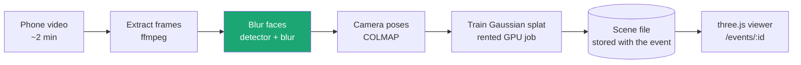

# Event replays in 3D — design doc

> **Owner:** [@nicolasrufino](https://github.com/nicolasrufino) (draft v0) · **Last reviewed:** Sep 29, 2026 · **Audience:** Event replays team · **Type:** Design doc · **Status:** Draft v0. Design sprint Thu, Oct 8 and Thu, Oct 15; doc due Sun, Oct 25; review Tue, Oct 27, 2026.

## Context and scope

People who miss an event only get photos. This project turns a two-minute phone video of the room into a 3D scene anyone can walk through on the event page. It's the club's computer-vision showcase. **Every face is blurred before anything is published.**

**Builds on:** the public event pages and events backend (**Nicolas Rufino**, **Om Patel**; early events work by **Dori**) and the phone-first QA by **valexisv**.

## Goals and non-goals

| Goals (demo Dec 3, 2026) | Non-goals |
|---|---|
| One real event captured and viewable in the browser | Live streaming |
| Faces blurred in every frame before training | Face recognition of any kind |
| Loads on a phone | Room occupancy or heatmaps (on hold) |

## Design

## Alternatives considered

| Option | Why not |
|---|---|
| NeRF | Slower to train and render than Gaussian splats |
| A 360° photo | Not 3D; much less interesting as a CV project |
| Paid capture apps | Not our own work, and not open source |

## Cross-cutting concerns

- **Privacy:** blur before training; post a sign at any event we capture; no face matching.
- **Cost:** a few dollars of GPU time per scene; needs a budget approval.
- **Size:** compress scenes so they stream on phones.

## Open questions

1. GPU provider and budget (Modal or RunPod)?
2. Who films at events, and on which phone?
3. Where do scene files live (Supabase Storage vs Vercel Blob)?
