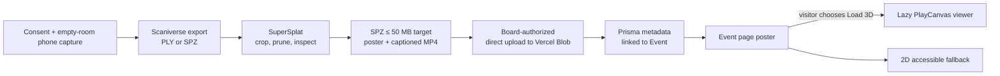

# Event replays in 3D — research

> **Owner:** [@nicolasrufino](https://github.com/nicolasrufino) · **Last reviewed:** Oct 1, 2026 · **Audience:** Event replays team · **Type:** Research

## Decision

Use **Scaniverse phone capture → SuperSplat cleanup/compression → SPZ → Vercel Blob → PlayCanvas viewer** for v1. Keep the original phone video as the accessible fallback. Do not build or operate a training service before the Dec 3 demo.

## Capture options

| Option | Phone workflow | Cost/compute | Output | Fit for v1 |
|---|---|---|---|---|
| Gaussian splat: Scaniverse | Walk the room with a supported phone; app/cloud reconstructs it | Mobile capture is available; current plan/export limits must be checked before capture `(verify)` | PLY, SPZ; cloud 360 flow also offers USDZ | **Best:** short path to an open, compressed file |
| Gaussian splat: Luma AI | Upload a phone orbit/walkthrough | Current capture/export terms are unclear from public pricing `(verify)` | Export availability/format `(verify)` | Backup only; avoid vendor lock-in |
| Gaussian splat: Polycam | Capture in the app | Free tier is limited; Gaussian splats and exports depend on the current plan `(verify)` | PLY and other exports `(verify)` | Backup if Scaniverse fails |
| Gaussian splat: Postshot | Record on phone; process on a capable Windows/NVIDIA computer | Local GPU requirements and license limits `(verify)` | PLY/splat formats `(verify)` | Good lab fallback if hardware exists |
| Gaussian splat: nerfstudio + gsplat | Extract frames, solve poses, train on CUDA | Open source; default Splatfacto documents about 6 GB GPU memory, big about 12 GB | PLY | Best learning path, too much v1 operations risk |
| Photogrammetry | Take many sharp, overlapping photos around a still room | Free/open tools exist; processing can be slow `(verify)` | Textured mesh, commonly OBJ/glTF after conversion `(verify)` | More geometric, less forgiving of people/motion |
| 360-degree video | Put a 360 camera at a fixed point or walk with it | Requires borrowing/buying a camera; Scaniverse cloud 360 is paid | MP4 fallback; can also reconstruct PLY/SPZ | Useful fallback, but a flat panorama is not walk-through 3D |

Scaniverse documents recent iPhone and Android requirements and says LiDAR models can improve results; its 360 workflow accepts supported INSV or equirectangular MP4 and exports splats as PLY/SPZ/USDZ ([quickstart](https://www.nianticspatial.com/docs/scaniverse/quickstart/), [360 guide](https://www.nianticspatial.com/docs/scaniverse/360camera/index.html)). Nerfstudio uses gsplat, accepts COLMAP initialization, and exports Gaussian-splat PLY files; its published presets use roughly 6 GB or 12 GB of GPU memory ([Splatfacto docs](https://docs.nerf.studio/nerfology/methods/splat.html)). gsplat is CUDA-based and is optimized for training memory and speed ([gsplat docs](https://docs.gsplat.studio/main/index.html)).

### Capture reality

- Splats reproduce appearance well but do not create reliable collision geometry. Constrain movement to an orbit or bounded walk.
- Moving people become ghosts or floaters. Capture an empty room first; stage a few consenting, still participants only after that succeeds.
- Lock focus/exposure if the app permits it `(verify)`. Avoid mirrors, blank walls, flashing screens, and lighting changes.
- A 60–120 second slow loop with strong overlap is the starting target `(verify)`; test the chosen phone before the real event.

## Web viewers

| Viewer | Formats | Strength | Risk | v1 call |
|---|---|---|---|---|
| PlayCanvas engine / SuperSplat Viewer | PLY, compressed PLY, SOG; SPZ through parser | Open source, web-focused, self-hostable viewer; SuperSplat edits/converts many formats | Adds a new frontend dependency; exact iOS floor needs testing `(verify)` | **Choose** |
| Spark | Common splat formats `(verify)` | Designed for Three.js integration | API, license, mobile behavior `(verify)` | Spike only if PlayCanvas fails |
| `@mkkellogg/gaussian-splats-3d` | PLY, SPLAT, KSPLAT | Direct Three.js integration; KSPLAT optimized for its loader | Project documents suboptimal mobile performance and CPU-sort artifacts | Do not choose for phone-first v1 |
| `<model-viewer>` | glTF/GLB meshes, not Gaussian splats | Accessible web component and strong mobile/AR support `(verify)` | Requires a mesh conversion and loses splat appearance | Mesh fallback only |

SuperSplat can import PLY, SPLAT, SOG, SPZ and KSPLAT and export web formats ([import/export docs](https://developer.playcanvas.com/user-manual/supersplat/editor/import-export/)). Its standalone viewer is a static site and supports a poster image ([viewer repository](https://github.com/playcanvas/supersplat-viewer)). The Three.js alternative explicitly lists suboptimal mobile performance and recommends KSPLAT for its fastest load path ([GaussianSplats3D repository](https://github.com/mkkellogg/GaussianSplats3D)).

## Formats and size budget

| Format | Contains | Web use | Size guidance |
|---|---|---|---|
| `.ply` | Usually full Gaussian attributes; PLY can also mean an ordinary point cloud | Interchange/archive | Baseline; often tens to hundreds of MB for a room `(verify)` |
| `.splat` | Compact, simple splat records | Broad viewer interchange | Smaller than full PLY in many pipelines `(verify)` |
| `.spz` | Open compressed Gaussian splats | **v1 delivery** | Niantic reports about 10× smaller than equivalent PLY; validate quality and size on our scene |
| `.ksplat` | GaussianSplats3D-specific compressed layout | Best with that viewer | Compression and portability are viewer-specific |
| `.sog` | PlayCanvas web delivery/streaming format | Strong PlayCanvas option | PlayCanvas recommends it for stronger compression/faster loading; conversion adds a step |
| `.gltf` / `.glb` | Triangle mesh, materials, textures, animation | Standard mesh delivery; works with `<model-viewer>` | Not a native splat container; size depends on geometry/textures `(verify)` |

PlayCanvas reports compressed web splat formats at roughly 15–20× smaller than PLY and currently recommends SOG for web delivery ([format overview](https://developer.playcanvas.com/user-manual/gaussian-splatting/formats/), [SPZ notes](https://developer.playcanvas.com/user-manual/gaussian-splatting/formats/spz/)). Niantic describes SPZ as about 10× smaller than its PLY equivalent ([SPZ repository](https://github.com/nianticlabs/spz)). These are vendor/project ratios, not a promise for our capture.

**Ship budget:** target one SPZ at **≤ 50 MB**, warn before loading on cellular, and keep a poster under **300 KB** `(verify)`. Treat 50 MB as a product budget, not an industry norm. If the scene misses it, crop/prune it, lower spherical-harmonic detail, or ship the 2D fallback.

## Mobile performance

| Guardrail | Acceptance target |
|---|---|
| Initial event page | Text and poster render without downloading the viewer or scene |
| Start | Explicit “Load 3D replay (N MB)” button; never autoplay on mobile |
| Viewer code | Dynamic import after interaction |
| Scene | ≤ 50 MB SPZ target `(verify)`; one scene loaded at a time |
| Rendering | Cap device pixel ratio; pause when tab is hidden; dispose GPU resources on exit |
| Controls | Touch orbit plus keyboard controls; visible reset; respect reduced motion |
| Failure | Timeout/error offers the video/photo fallback without losing event content |
| Devices | Test Safari on a recent iPhone and Chrome on a mid-range Android; exact minimum matrix `(verify)` |

Mobile memory is the harder constraint than download size: decoded attributes, sorting buffers, framebuffer, and the browser all coexist. The selected library must be tested on physical phones. GaussianSplats3D warns that mobile performance is suboptimal; gsplat likewise warns that large scenes can exhaust GPU memory ([viewer notes](https://github.com/mkkellogg/GaussianSplats3D), [large-scene notes](https://docs.gsplat.studio/main/examples/large_scale.html)).

## Storage and bandwidth

Vercel Functions cap request/response bodies at 4.5 MB and recommend direct client uploads for larger files ([Vercel limit](https://vercel.com/docs/errors/function_payload_too_large), [client upload guide](https://vercel.com/docs/vercel-blob/client-upload)). Therefore the API should authorize an upload but never proxy the scene bytes.

| Store | Published cost snapshot (Oct 1, 2026) | Example: 20 × 50 MB scenes + 100 full downloads each/month | Call |
|---|---|---|---|
| Vercel Blob | Hobby includes 1 GB storage and 10 GB transfer; on-demand lists $0.023/GB-month storage and $0.05/GB transfer | 1 GB stored; 100 GB transferred → about $4.50 after 10 GB included, before request/origin charges `(verify)` | **v1:** already on Vercel, simplest direct upload |
| Cloudflare R2 Standard | 10 GB-month free; $0.015/GB-month; direct egress free; operation charges after free tier | Fits published free storage/request tiers | Scale alternative if replay traffic makes Blob transfer material |
| Backblaze B2 | Current rates and CDN arrangement `(verify)` | `(verify)` | Do not add another vendor for v1 |

Vercel’s current pricing page also says blobs over 512 MB are not cached and recommends multipart uploads over 100 MB ([Blob pricing and limits](https://vercel.com/docs/vercel-blob/usage-and-pricing)). Cloudflare publishes 10 GB-month free, $0.015/GB-month Standard storage, and free direct egress ([R2 pricing](https://developers.cloudflare.com/r2/pricing/)). Recheck prices before launch.

## Consent and privacy

This is operational guidance, not legal advice.

| Before | During | Before publishing | After publishing |
|---|---|---|---|
| Name a capture owner and private opt-out contact | Film only the signed zone | Human-review every source frame and the final 3D view for faces, badges, screens, and whiteboards | Keep a documented unpublish/delete path |
| Put signage at registration and every entrance | Announce capture aloud | Blur/remove everyone without explicit release; no recognition or identity matching | Honor removal requests promptly |
| Capture an empty-room pass | Provide a clearly marked no-camera area and route | Get written release for anyone intentionally featured | Delete raw captures after the agreed retention window `(verify)` |
| Tell attendees where/how the replay will be used | Stop if someone opts out | Record approver, date, asset hash, and consent status | Limit raw access to named processors |

Illinois’s Right of Publicity Act generally bars commercial use of an individual’s identity without previous written consent, with exceptions; the team should have UIC/club counsel or Student Affairs confirm application to club promotion `(verify)`. UIC itself publishes an individual media consent form covering image, likeness, and voice on websites and social media ([UIC media consent form](https://etl.ed.uic.edu/wp-content/uploads/sites/459/2024/07/UIC-Media-Consent-Form-for-Individuals.pdf)). Use signage as notice, **not** as a substitute for a release when a person is featured.

Blurring must happen before any raw capture is sent to a public or third-party reconstruction service. If a capture app cannot process a blurred input, capture the empty room or do not use that service. A final splat can preserve recognizable faces even when source frames are no longer visible.

## Accessibility fallback

- Always publish a poster image, short captioned 2D video or curated photos, event title, date, location, and text summary.
- Make 3D enhancement optional. The event page remains complete if WebGL/WebGPU, JavaScript, bandwidth, motion tolerance, or pointer precision prevents using it.
- Give the canvas an accessible name and concise controls/help text; do not trap keyboard focus.
- Respect `prefers-reduced-motion`; do not auto-rotate or auto-play.
- Caption the video and write meaningful alt text for the poster/photos. Provide a transcript when speech is included.

## Recommended v1 pipeline

**Why:** it is the shortest phone-to-web path, produces a portable open format, avoids a semester-critical GPU service, respects Vercel’s body limit, and keeps the event useful on low-power or inaccessible devices. The team still learns capture, 3D cleanup, object storage, authenticated publishing, and WebGL delivery. Keep nerfstudio + gsplat as a post-v1 experiment after the public path works.

## Sources to recheck at implementation

[Vercel Blob](https://vercel.com/docs/vercel-blob/usage-and-pricing) · [Scaniverse](https://www.nianticspatial.com/docs/scaniverse/quickstart/) · [SuperSplat](https://developer.playcanvas.com/user-manual/gaussian-splatting/editing/supersplat/) · [GaussianSplats3D](https://github.com/mkkellogg/GaussianSplats3D) · [nerfstudio Splatfacto](https://docs.nerf.studio/nerfology/methods/splat.html) · [gsplat](https://docs.gsplat.studio/main/index.html) · [Cloudflare R2](https://developers.cloudflare.com/r2/pricing/) · [UIC media consent](https://etl.ed.uic.edu/wp-content/uploads/sites/459/2024/07/UIC-Media-Consent-Form-for-Individuals.pdf)
