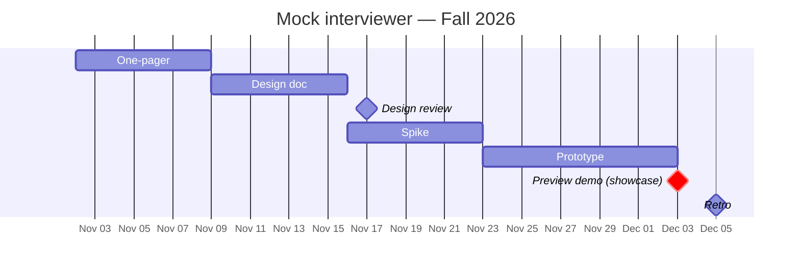

# Mock interviewer

> **Owner:** [@nicolasrufino](https://github.com/nicolasrufino) · **Last reviewed:** Sep 29, 2026 · **Audience:** Members and recruiters · **Type:** Project page

**Label:** `team: mock-interviewer` · **Priority:** later

Practice interviews by voice for roles in your tracker, then get a transcript with feedback. Runs through MCP on the member's own AI account.

| Milestone | Done when |
|---|---|
| 1. Spike | One 10-minute behavioral interview, end to end |
| 2. Role-aware | Questions come from a role in the member's tracker |
| 3. Feedback | Scored transcript saved to the dashboard |

Starts after the opportunity board tracker exists. **You learn:** voice interfaces, prompt design, evaluation.

## Timeline — Fall 2026

| Milestone | Date |
|---|---|
| One-pager due | Sun Nov 8 |
| Design doc due | Sun Nov 15 |
| Design review | Tue Nov 17 |
| Spike | week of Nov 16 |
| Prototype | week of Nov 23 |
| **Preview demo (showcase)** | **Thu Dec 3** |
| Retro | Sat Dec 5 |

## Artifacts

| File | What | Status |
|---|---|---|
| [okrs.md](okrs.md) | Objectives and key results, graded 0–1 | Due Tue Oct 6 |
| [design-doc.md](design-doc.md) | 1–3 page design doc | See timeline |
| [status/](status/) | Weekly snippet every Monday | From Mon Oct 12 |
| [launch-checklist.md](launch-checklist.md) | Must pass before the public release | Before the demo |
| [demos/](demos/) | Demo day writeup, slides, video | 2026-12-03 |
| [retro.md](retro.md) | Blameless retro and findings | After the demo |
