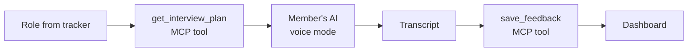

# Mock interviewer — design doc

> **Owner:** [@nicolasrufino](https://github.com/nicolasrufino) (draft v0) · **Last reviewed:** Sep 29, 2026 · **Audience:** Mock interviewer team · **Type:** Design doc · **Status:** Draft v0. One-pager due Sun, Nov 8; doc due Sun, Nov 15; review Tue, Nov 17, 2026.

## Context and scope

Members get few chances to practice real interviews. This lets them rehearse by voice for a role in their tracker and get a transcript with feedback. Like the resume builder, it runs on the member's own AI through MCP, so it costs the club nothing.

**Builds on:** the opportunity board tracker and the MCP server.

## Goals and non-goals

| Goals (preview, Dec 3, 2026) | Non-goals |
|---|---|
| One 10-minute behavioral interview, end to end | Grading candidates for the board |
| Questions tailored to a role in the tracker | Storing audio recordings |
| A transcript with 3 concrete improvements | Technical coding interviews (later) |

## Design

## Open questions

1. Browser voice (Web Speech API) or the AI client's own voice mode?
2. What feedback rubric (STAR structure, clarity, specifics)?
