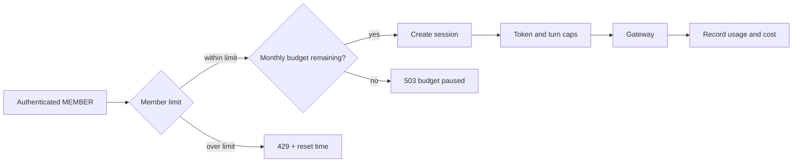

# Mock interviewer — research

> **Owner:** [@nicolasrufino](https://github.com/nicolasrufino) · **Last reviewed:** Oct 1, 2026 · **Audience:** Mock interviewer team · **Type:** Research

Observed facts below come from the linked pages or the repos named in [build-plan.md](build-plan.md). Estimates and product choices are labeled as such.

## Prior art

| Product | Observed pattern | Lesson for LOGICA |
|---|---|---|
| [Aced Practice (formerly Exponent/Pramp)](https://www.tryexponent.com/practice?src=homepage) | Scheduled peer video, reciprocal interviewer roles, shared editor for technical rounds, transcripts, and rubric-based AI feedback | A realistic round needs turn structure and actionable feedback, not only generated questions |
| [interviewing.io](https://interviewing.io/) | Anonymous technical mock interviews with humans **(verify)**; the page was blocked during research | Anonymity and human practice are valuable, but matching and video are a different product |
| [Google Interview Warmup](https://grow.google/certificates/interview-warmup/) | Speaks questions, transcribes answers, surfaces patterns rather than grading, and says it saves neither audio nor transcripts | Low-pressure practice and transparent feedback are better than a false hiring verdict |
| [Final Round AI](https://docs.finalroundai.com/docs/getting-started/subscribe-and-plans) | Live interview copilot plus post-session debriefs | Do **not** build covert live-interview assistance; this product is practice-only |
| [iarsingh/ai-mock-interviewer](https://github.com/iarsingh/ai-mock-interviewer) | MIT, local-first, typed fallback, browser speech, offline question bank | Voice must degrade to text; local-first is a useful privacy reference |
| [IliaLarchenko/Interviewer](https://github.com/IliaLarchenko/Interviewer) | Apache-2.0, speech-first, pluggable LLM/STT/TTS, streaming | Keep model and speech adapters replaceable |
| [DeepInterview](https://github.com/ngoanpv/DeepInterview) | Voice-first, multilingual, pre-call planning, rubric scorecard after the call | Separate the fast interview loop from slower evaluation |
| [karanjot-gaidu/ai-mock-interviewer](https://github.com/karanjot-gaidu/ai-mock-interviewer) | Next.js + AI SDK, STT chunks, code execution, server-only hidden tests | Never ship hidden evaluation data to the browser |

**Inference:** the common useful loop is plan → one question at a time → adaptive follow-up → structured feedback. Video, avatars, emotion analysis, and covert assistance do not improve the Dec 3 proof.

## Interaction modes

### Cost and latency assumptions

All figures are estimates, not quotes. Prices were read Oct 1, 2026 and must be checked before implementation.

- One session: 10 minutes, 6 candidate turns, 6 interviewer turns.
- Text LLM traffic: 30,000 input tokens total (repeated conversation context plus final evaluation) and 2,700 output tokens.
- Voice: 10 minutes of captured candidate audio and 6,000 generated TTS characters.
- Default LLM: `anthropic/claude-sonnet-5-5` through Vercel AI Gateway. Its listed rate is $2/M input and $10/M output; listed provider time-to-first-token is about 2.3 seconds. [Model page](https://vercel.com/ai-gateway/models/claude-sonnet-5.5)
- Gateway charges provider list price with no markup; the free tier includes $5/month until the account becomes paid. [Gateway pricing](https://vercel.com/docs/ai-gateway/pricing)

| Mode | Modeled variable cost/session | Modeled response latency | Decision |
|---|---:|---|---|
| Text chat + Claude | `(30k × $2/M) + (2.7k × $10/M) = $0.087` | ~2.3 s to first token; budget 3–8 s perceived per turn and measure in spike | **v0**: lowest integration, privacy, and accessibility risk |
| Browser Web Speech API + Claude | LLM `$0.087`; browser speech has no club API charge | Browser/network-dependent; measure on target devices | Later experiment only. `SpeechRecognition` is not Baseline and Chrome may send audio to a server-side recognition service. [MDN](https://developer.mozilla.org/en-US/docs/Web/API/SpeechRecognition) |
| Cascaded STT → Claude → TTS | LLM `$0.087` + Deepgram Nova-3 STT `10 × $0.0048 = $0.048` + Aura-2 TTS `6 × $0.030 = $0.180` = **$0.315** | STT endpointing + ~2.3 s LLM TTFT + TTS; Deepgram illustrates ~277 ms TTS first-byte after connection, not a guarantee | Best controllable Spring voice path; prototype and measure |
| Realtime speech-to-speech | OpenAI GPT-Live example: `10 × $0.05 = $0.50`, plus separately billed backend work | Designed for live conversation; benchmark interruption and reconnect behavior | Not v0; higher spend and a second model/provider |

Deepgram rates come from its [pricing page](https://deepgram.com/pricing): Nova-3 monolingual streaming is currently $0.0048/min and Aura-2 is $0.030/1k characters. Its TTS latency guide defines total latency as network + first byte + synthesis and reports illustrative—not guaranteed—measurements. [Latency guide](https://developers.deepgram.com/docs/text-to-speech-latency) OpenAI bills GPT-Live per second and lists $0.05/min; backend model/tool use is separate. [Pricing](https://platform.openai.com/pricing) [Cost method](https://developers.openai.com/api/docs/guides/voice-latency-cost)

**Observed platform constraint:** Vercel documents HTTP response streaming and recommends AI SDK `streamText`. [Streaming guide](https://vercel.com/docs/functions/streaming-functions) Two current Vercel pages conflict on WebSocket hosting: a June 2026 knowledge-base page says Functions support pinned WebSocket connections, while the general limits page says Functions cannot act as a WebSocket server. Treat native WebSockets as **(verify)** before voice implementation. [WebSocket article](https://vercel.com/kb/guide/do-vercel-serverless-functions-support-websocket-connections) [Limits](https://vercel.com/docs/limits)

## Coding rounds

| Option | Evidence and tradeoff | Recommendation |
|---|---|---|
| CodeMirror editor, no execution | CodeMirror is a modular browser editor under MIT. [Docs](https://codemirror.net/docs/ref/) | Spring first step: capture code and explanation without an execution security boundary |
| Monaco editor, no execution | Monaco is MIT, powers VS Code, and is not supported on mobile browsers. [Project](https://microsoft.github.io/monaco-editor/) | Skip: heavier and weak on phones |
| Vercel Sandbox execution | Isolated Firecracker microVMs are intended for untrusted code. Hobby includes 5 CPU-hours, 420 GB-hours memory, and 5,000 creations/month; overage starts at regional rates. [Sandbox](https://vercel.com/docs/sandbox) [Pricing](https://vercel.com/pricing) | Spring follow-up only after timeouts, network denial, output limits, language allowlist, and abuse tests |
| No coding UI | Technical discussion can still assess clarification, approach, complexity, testing, and communication | **v0**: behavioral round only; no execution |

If execution is added, send only the public prompt to the client; keep reference solutions and hidden tests server-side. Cap wall time, CPU, memory, output bytes, and runs/session.

## Feedback design

Scores are coaching signals, never hiring predictions. Return a score, transcript evidence, one improvement, and a stronger example for every criterion. If evidence is missing, say “not observed”; do not infer personality, emotion, accent quality, disability, or protected traits.

| Round | Criterion | What earns a strong score |
|---|---|---|
| Behavioral | Situation / task | Enough context and a clear personal responsibility |
| Behavioral | Action | Specific “I” actions, reasoning, and tradeoffs |
| Behavioral | Result / reflection | Outcome with evidence plus what the member learned |
| Behavioral | Relevance | Directly answers the question without filler |
| Behavioral | Communication | Clear structure, concise wording, and understandable terminology |
| Technical | Clarification | States assumptions and asks useful questions before committing |
| Technical | Problem solving | Explains an incremental approach and alternatives |
| Technical | Correctness | Handles the main case and identifies edge cases |
| Technical | Complexity / tradeoffs | Gives defensible time/space costs or system tradeoffs |
| Technical | Testing | Proposes representative, boundary, and failure cases |
| Technical | Communication | Thinks aloud without turning the answer into an unstructured monologue |

UIC Career Services recommends STAR for well-rounded behavioral answers. [UIC guide](https://careerservices.uic.edu/wp-content/uploads/sites/26/2017/08/CPG2016-17.pdf) Human review of a small evaluation set is still required: LLM scores can vary, so compare rubric dimensions and cited evidence—not only totals.

## Question sources and licensing

| Source | Use |
|---|---|
| Team-authored questions | Default. Record author, date, target role, difficulty, rubric, and license in each fixture |
| O*NET 31.0 occupation skills, work activities, and work styles | Use as role competencies, with attribution and change notice. Most database content is CC BY 4.0, with exceptions to check. [License](https://www.onetcenter.org/license_agreements.html) [Database](https://www.onetcenter.org/database.html) |
| Job posting / tracker role | Extract competencies; do not reproduce proprietary question banks or sensitive application notes |
| LeetCode | **Do not copy or lightly paraphrase problems, examples, or solutions.** Its terms identify questions and solutions as copyrighted content. [Terms](https://leetcode.com/terms/) |
| Open-source repositories | Learn patterns; copy content only when its exact license and attribution obligations are reviewed |

For technical prompts, author original scenarios from public concepts (arrays, graphs, APIs, databases), keep a provenance field, and run a phrase search before publishing.

## Abuse and cost controls

- Allow MEMBER accounts only; never trust a supplied `userId`.
- v0 allowance: 2 starts/member/day, 10 minutes or 8 candidate turns/session, one active session/member, 12,000 generated tokens/session hard stop.
- Server-side monthly cap: **$25**, warning at $15, stop new sessions at $20, reserve $5 for in-flight/reconciliation variance. The application check is authoritative; Vercel alerts/top-ups are defense in depth. Do not enable automatic top-up.
- Reject oversized messages, prompt-injection attempts to reveal instructions/questions, and concurrent/replayed turn IDs. Log counts, token use, modeled cost, and error class—not prompt bodies.
- At the text estimate, the $20 operating threshold funds `floor($20 / $0.087) = 229` sessions/month before infrastructure cost. Recompute from actual Gateway usage metadata weekly.

## Privacy and accessibility

| Topic | v0 policy | Later voice requirement |
|---|---|---|
| Consent | Before start: name data sent to the model, retention, delete control, and that scores are coaching only | Separate explicit microphone/audio-processing consent |
| Audio | Never capture or store | Default: stream and discard; recording off. If recording is ever proposed, require a new review and opt-in |
| Transcript | Store candidate/interviewer text for 30 days, then delete automatically; allow immediate member deletion | Display live editable transcript so recognition mistakes can be corrected |
| Feedback | Store with transcript for 30 days; member-only | Same |
| Access | Owner only; exec access is not required for v0. Operational logs exclude content | Same |
| Provider data | Route only through approved Gateway/provider settings; verify retention/ZDR terms before pilot | Verify every speech vendor separately |
| Sensitive content | Tell members not to paste secrets, private employer material, or third-party personal data | Do not infer accent, emotion, identity, or disability from audio |

Accessibility baseline: full keyboard flow, visible focus, labeled controls, `aria-live` status for streaming without announcing every token, pause/stop controls, reduced-motion support, no time penalty for assistive-technology use, and text entry always available. W3C recommends text alternatives and accessible control labels; transcripts/captions provide text equivalents for audio. [WAI principles](https://www.w3.org/WAI/fundamentals/accessibility-principles/) [Accessible media](https://www.w3.org/WAI/media/av/)

The paired frontend currently sets `Permissions-Policy: ... microphone=()` in `next.config.ts`. Voice work must deliberately change and test that policy; v0 text requires no change.

## Recommended Dec 3 v0

Ship one authenticated, 10-minute **text behavioral interview** in the existing dashboard, tailored to a tracker role when available and otherwise a member-selected role. Stream short Claude Sonnet 5.5 interviewer turns through the backend; save the transcript; generate one structured STAR-based report with evidence and three improvements; add delete and 30-day expiry; enforce the $20 operating threshold.

Why: it proves the product’s unique loop—role-aware practice plus useful feedback—inside the real auth, database, and dashboard. It also fits Nov 17–Dec 2 without adding microphone compatibility, audio consent/retention, realtime transport, or untrusted-code execution. Voice, MCP exposure, and coding rounds become measured Spring 2027 proposals rather than Dec 3 dependencies.
