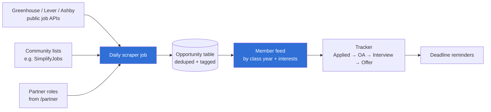
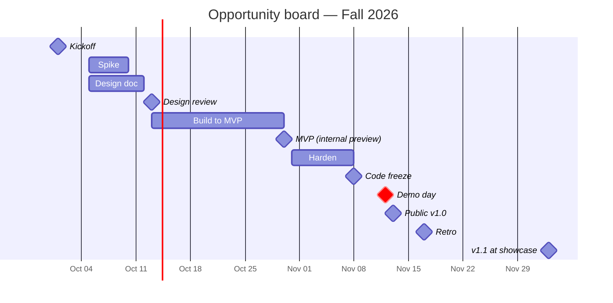

# Opportunity board

> **Owner:** [@nicolasrufino](https://github.com/nicolasrufino) · **Last reviewed:** Sep 29, 2026 · **Audience:** Members and recruiters · **Type:** Project page

**Label:** `team: opportunity-board` · **Priority:** main focus

Every internship and new-grad role worth applying to, always current, filtered to what each member can actually get — plus a tracker for every application.

| Milestone | Done when | Area |
|---|---|---|
| 1. Spike | One scraper pulls one company's board into a local table, deduped | Backend |
| 2. Data model | `Opportunity` with tags (year, field, location, sponsorship, deadline) + migration | Backend |
| 3. Daily job | Scheduled job refreshes all sources; closed roles drop off | Backend |
| 4. Feed | Dashboard tab shows roles matched to the member's year | Frontend |
| 5. Tracker | Members move applications through stages; reminders fire before deadlines | Full-stack |

**Rules:** public APIs and lists only — no scraping sites whose terms forbid it (LinkedIn, Indeed, Handshake).
**You learn:** scraping, scheduled jobs, data pipelines, search.

## Timeline — Fall 2026

| Milestone | Date |
|---|---|
| Kickoff | Thu Oct 1 |
| OKRs published | Tue Oct 6 |
| Spike | Oct 5–9 |
| Design doc due | Sun Oct 11 |
| Design review | Tue Oct 13 |
| MVP · internal preview | Fri Oct 30 |
| Code freeze | Sun Nov 8 |
| **Demo day** | **Thu Nov 12** |
| Public v1.0 | Fri Nov 13 |
| Retro | Tue Nov 17 |
| Showcase (v1.1) | Thu Dec 3 |
| OKR grades | Fri Dec 11 |

## Artifacts

| File | What | Status |
|---|---|---|
| [okrs.md](okrs.md) | Objectives and key results, graded 0–1 | Due Tue Oct 6 |
| [design-doc.md](design-doc.md) | 1–3 page design doc | See timeline |
| [status/](status/) | Weekly snippet every Monday | From Mon Oct 12 |
| [launch-checklist.md](launch-checklist.md) | Must pass before the public release | Before the demo |
| [demos/](demos/) | Demo day writeup, slides, video | 2026-11-12 |
| [retro.md](retro.md) | Blameless retro and findings | After the demo |
