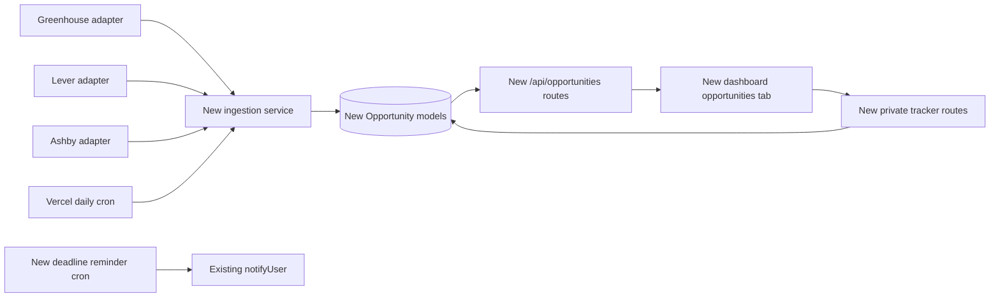

# Opportunity board — build plan

> **Owner:** [@nicolasrufino](https://github.com/nicolasrufino) · **Last reviewed:** Oct 1, 2026 · **Audience:** Opportunity board team · **Type:** Build plan

## Ship shape



This fits the implementation in `backend`: Next.js route handlers, the shared `lib/prisma.ts` client, Auth.js `auth()`, `User.gradYear`, `Notification`, `EmailPreference`, `lib/notify.ts`, and the `CRON_SECRET` pattern in `app/api/cron/event-reminders/route.ts`. Frontend work extends the existing kept-alive dashboard shell in `src/components/dashboard/Dashboard.tsx`, `sections`/`navFor()` in `types.ts`, and the same-origin `api()` wrapper in `src/lib/api.ts`. Every name below marked **new** does not exist yet.

## Backend design

### New Prisma types

```prisma
enum OpportunitySource { GREENHOUSE LEVER ASHBY PARTNER }
enum OpportunityKind { INTERNSHIP NEW_GRAD }
enum SponsorshipStatus { YES NO UNKNOWN }
enum TrackedStage { SAVED APPLIED OA INTERVIEW OFFER REJECTED WITHDRAWN }

model Opportunity { // new
  id                    String   @id @default(cuid())
  source                OpportunitySource
  sourceId              String
  dedupeKey             String   @unique
  company               String
  title                 String
  kind                   OpportunityKind
  canonicalUrl          String
  applyUrl               String
  location              String?
  workplaceType         String?
  descriptionPlain      String?  @db.Text
  eligibleGradYears     Int[]
  eligibilityEvidence   String?
  sponsorship           SponsorshipStatus @default(UNKNOWN)
  sponsorshipEvidence   String?
  deadline              DateTime?
  sourcePublishedAt     DateTime?
  sourceUpdatedAt       DateTime?
  firstSeenAt           DateTime @default(now())
  lastSeenAt            DateTime @default(now())
  missedRuns            Int      @default(0)
  closedAt              DateTime?
  tagRuleVersion        Int      @default(1)
  trackedApplications   TrackedApplication[]

  @@unique([source, sourceId])
  @@index([closedAt, kind])
}

model TrackedApplication { // new
  id             String       @id @default(cuid())
  userId         String
  opportunityId  String?
  company        String
  title          String
  url            String?
  stage          TrackedStage @default(SAVED)
  appliedAt      DateTime?
  deadline       DateTime?
  notes          String?      @db.Text
  reminderSentAt DateTime?
  createdAt      DateTime     @default(now())
  updatedAt      DateTime     @updatedAt
  user           User         @relation(fields: [userId], references: [id], onDelete: Cascade)
  opportunity    Opportunity? @relation(fields: [opportunityId], references: [id], onDelete: SetNull)

  @@unique([userId, opportunityId])
  @@index([userId, stage])
  @@index([deadline, reminderSentAt])
}
```

Add `trackedApplications TrackedApplication[]` to existing `User`. `company`, `title` and `url` are snapshots so a tracked item survives source removal; `opportunityId` is nullable for member-added roles. Keep `workplaceType` as a validated string in v1 because providers use different vocabularies.

### New modules and routes

| Path | Rule / behavior |
|---|---|
| `lib/opportunities/adapters/{greenhouse,lever,ashby}.ts` | Fetch only configured boards; map vendor JSON to one internal type. No new dependency: use Node/Next `fetch`. |
| `lib/opportunities/{normalize,tag,ingest}.ts` | Pure normalize/tag functions; transactionally upsert; increment `missedRuns` only after a successful complete board fetch. |
| `GET /api/opportunities` | `auth()` required; `accountKind === MEMBER`; return open roles filtered by `gradYear`, with query filters and a bounded page size. Unknown eligibility remains visible. |
| `GET /api/opportunities/[id]` | Same member guard; one open role, or a closed role if the caller tracks it. |
| `GET, POST /api/tracked-applications` | Signed-in members only. GET always filters `userId = session.user.id`; POST ignores any client user ID. Validate strings, URLs, dates and stage. |
| `PATCH, DELETE /api/tracked-applications/[id]` | Load by `{id, userId}`; another member receives `404`, preventing ID probing. |
| `POST /api/board/opportunities` | Optional partner/manual entry; start with existing `requireBoard()` from `lib/board-guard.ts`; creates `source = PARTNER`. |
| `GET /api/cron/opportunities` | Follow the existing event-reminder route's `Authorization: Bearer $CRON_SECRET` check; return source counts/errors, not descriptions. |
| `GET /api/cron/application-reminders` | Find the caller-independent due set, call existing `notifyUser()` once, then set `reminderSentAt`. |

Do not reuse `MembershipApplication`/`ApplicationStatus`: those models are for joining LOGICA. Do not reuse `BoardItem`: its `MONEY` and `OUTREACH` invariants are club operations, not member-private job tracking.

### Cron and notifications

Add both new cron paths to the existing `backend/vercel.json`; keep the daily ingestion schedule and reminder semantics coarse. Extend existing `EmailPreference` with a new `opportunityReminders Boolean @default(true)` and extend `lib/notify.ts`'s `Category` union. The reminder job sends only for deadlines in the next 48 hours, skips rows with `reminderSentAt`, and never emails notes.

## Frontend design

- Add new `opportunities` to `Section`, `titles`, `MEMBER_NAV` and exec member-facing nav in `src/components/dashboard/types.ts`.
- Add **new** `Opportunities.tsx` under `src/components/dashboard/`; render it through a `Pane` in `Dashboard.tsx` so loaded filters and scroll position follow the shell's existing keep-mounted behavior.
- Fetch `/api/opportunities` and `/api/tracked-applications` inside the section, as the current shell does for section-owned board pipelines. Use existing `api()`; do not add a data-fetching library.
- Four required states: loading, empty, error with retry, ready. Filters: class year defaulted from profile, kind, location/workplace and sponsorship.
- Tracker supports Saved → Applied → OA → Interview → Offer, plus Rejected/Withdrawn. Use text labels in addition to color; all controls need labels, focus rings and keyboard operation.

## Schedule

| Week | Outcome | Fixed checkpoint |
|---|---|---|
| Oct 1–4 | Kickoff; confirm source allowlist, owners and local setup | **Kickoff Thu Oct 1** |
| Oct 5–11 | Greenhouse spike; source/legal review; approve schema/API/UI design | OKRs Tue Oct 6; design doc Sun Oct 11 |
| Oct 12–18 | Review design; merge schema, migration, normalizer and Greenhouse adapter | **Design review Tue Oct 13** |
| Oct 19–25 | Lever + Ashby adapters; ingestion cron; feed API; dashboard shell | Friday release train |
| Oct 26–30 | Feed filters, tracker CRUD, core unit/route tests; internal preview | **MVP Fri Oct 30** |
| Oct 31–Nov 8 | Dedupe/closure hardening, reminders, accessibility, Playwright happy path, member QA | Mid-term OKR Tue Nov 3; **code freeze Sun Nov 8** |
| Nov 9–13 | Fixes only; rollback rehearsal; demo assets and release notes | **Demo Thu Nov 12; v1.0 Fri Nov 13** |
| Nov 14–20 | Retro; fix launch findings; measure source health and use | Retro Tue Nov 17 |
| Nov 21–27 | v1.1: partner/manual roles only if v1 is stable; polish empty/error states | Friday release train |
| Nov 28–Dec 3 | Rehearse showcase, verify metrics and docs, ship v1.1 | **Showcase Thu Dec 3** |

## Issue-ready backlog

Titles follow the org's short imperative style. Apply `team: opportunity-board` to every issue.

| # | Title | Area | Size | Acceptance criteria | Depends on |
|---:|---|---|:---:|---|---|
| 1 | Document approved opportunity sources | Backend | S | Allowlist names board key, owner, API/terms link; Greenhouse/Lever/Ashby only | — |
| 2 | Add opportunity Prisma models | Backend | M | New enums/models/relations match plan; migration and generated client succeed | 1 |
| 3 | Normalize opportunity fields | Backend | S | Pure functions normalize company/title/location/URL; table tests cover tracking params and punctuation | — |
| 4 | Tag class-year eligibility | Backend | M | Rules return years, evidence and version; conflicting/absent text returns unknown; tests cover each rule | — |
| 5 | Detect sponsorship language | Backend | S | YES/NO/UNKNOWN rules store evidence; negation and ambiguous cases tested | — |
| 6 | Import Greenhouse postings | Backend | M | Configured board maps documented fields; fixture tests cover empty/malformed responses | 1, 3 |
| 7 | Import Lever postings | Backend | M | Pagination and documented fields map; fixture tests cover EU/global base selection | 1, 3 |
| 8 | Import Ashby postings | Backend | M | Listed jobs map; unlisted jobs excluded; fixture tests cover missing optional fields | 1, 3 |
| 9 | Upsert and dedupe opportunities | Backend | L | Source upserts are idempotent; fingerprint collisions do not duplicate; failed runs close nothing | 2–8 |
| 10 | Close stale opportunities safely | Backend | M | Two successful misses set `closedAt`; reappearing job reopens; tests cover partial/source failure | 9 |
| 11 | Schedule daily opportunity imports | Backend | M | New CRON_SECRET-protected route and `vercel.json` entry; response contains counts/errors only | 9, 10 |
| 12 | List matched opportunities | Backend | M | Member-only route filters on existing `User.gradYear`; unknown eligibility stays visible; pagination bounded | 2, 9 |
| 13 | Track a job application | Backend | M | Member can create/list own linked or manual item; input validation and duplicate behavior tested | 2 |
| 14 | Update and delete a tracked application | Backend | M | Owner can change stage/dates/notes and delete; other user gets 404; invalid transitions rejected | 13 |
| 15 | Send application deadline reminders | Backend | M | 48-hour query calls existing `notifyUser()` once; preference and `reminderSentAt` prevent repeats | 13, 14 |
| 16 | Add opportunities to dashboard navigation | Frontend | S | Member and exec nav show Opportunities; speaker nav does not; title and route work | 12 |
| 17 | Build opportunity feed states | Frontend | M | Loading, empty, retryable error and role cards render; apply link uses canonical external URL | 12, 16 |
| 18 | Filter the opportunity feed | Frontend | M | Defaults to profile grad year; kind/location/workplace/sponsorship filters are labeled and URL-safe | 17 |
| 19 | Build application tracker | Frontend | L | Create manual/linked item; move stages; edit deadline/notes; delete with confirmation | 13, 14, 16 |
| 20 | Test feed and tracker accessibility | QA | M | Desktop/phone, keyboard, focus, labels, non-color stage text, loading/empty/error results recorded | 17–19 |
| 21 | Add opportunity route authorization tests | QA | M | Signed-out 401; speaker forbidden; member isolation; cron wrong secret; all run in Vitest | 11–15 |
| 22 | Add opportunity dashboard end-to-end test | QA | M | Playwright covers sign-in fixture, filter, save, stage update and reload persistence | 17–19 |
| 23 | Run internal preview and triage findings | QA | M | At least 3 members use it for at least 2 days; issues use Page · Did · Saw · Expected | 20–22 |
| 24 | Complete opportunity board launch checks | QA | S | Every launch-checklist item has evidence or a blocking issue; rollback tag identified | 23 |

## First PRs for a new member

Good-first-issue candidates are isolated and testable:

| Backlog | First PR boundary |
|---|---|
| #3 Normalize opportunity fields | One pure module plus table tests; no database |
| #5 Detect sponsorship language | One rule file plus fixtures |
| #16 Add opportunities to dashboard navigation | Types/nav/title and placeholder empty pane only |
| #20 Test feed and tracker accessibility | Manual QA report; no code required |
| #1 Document approved opportunity sources | One reviewed allowlist entry with links |

## Test plan

| Layer | Repo convention | Required coverage |
|---|---|---|
| Pure backend | Existing Vitest `*.test.ts` beside `lib/` modules; run `npm test` | URL normalization, dedupe key, class year, sponsorship, adapter fixtures, two-miss closure |
| Backend routes | Import route handlers directly, matching current route tests | 400 validation, 401 signed out, speaker forbidden, member ownership/ID probing, cron secret, idempotency |
| DB-backed | Dedicated test database and existing skip conditions; migration in `prisma/migrations/` | Unique constraints, cascade/set-null behavior, concurrent upsert |
| Frontend unit | Existing Vitest runner via `npm test` | Filter logic, state rendering, stage labels, API error behavior |
| End to end | Existing `playwright.config.ts`, `e2e/*.e2e.ts`, built app via `next start` | Feed → filter → save → stage → reload; signed-out protection; phone viewport and keyboard smoke |
| Manual QA | Role guide format | Desktop/phone, keyboard only, empty/error/closed roles, external links, screen-reader labels |

Before each PR in both code repos: `npm run lint`, `npx tsc --noEmit`, `npm test`; backend also runs `npx prisma generate` and `npm run build`. Before release, run the frontend Playwright suite and both builds.

## Risk register

| Risk | Likelihood | Mitigation |
|---|:---:|---|
| ATS terms do not permit aggregation | Medium | Written approval/allowlist before public release; remove on request; never bypass controls |
| Vendor response changes | Medium | Small adapters, saved fixtures, schema validation, per-source errors |
| Bad run closes good jobs | Medium | Only count complete successful runs; require two misses; test failures |
| False class-year or sponsorship tag | High | Store evidence, use UNKNOWN, show source text, version rules |
| Duplicate roles | Medium | Source key plus normalized fingerprint; collision log and manual correction |
| Tracker data leaks | Low | Server-side member guard; every query scoped to session user; cross-user route tests |
| Reminder spam | Medium | Preference, 48-hour window, `reminderSentAt`, idempotency test |
| Vercel cron/runtime exceeds limits | Medium | Three sources first, sequential per host, bounded boards, counts and duration logs |
| Volunteer schedule slips | Medium | MVP excludes manual partner entry and advanced ranking; freeze on Nov 8 |
| Existing dashboard `applications` name confuses users | Medium | Call new member section “Opportunities”; reserve existing exec “Applications” for club applications |
