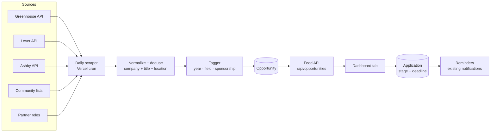

# Opportunity board — design doc

> **Owner:** [@nicolasrufino](https://github.com/nicolasrufino) (draft v0) · **Last reviewed:** Sep 29, 2026 · **Audience:** Opportunity board team · **Type:** Design doc · **Status:** Draft v0. The team owns it from kickoff (Oct 1); review Tue, Oct 13, 2026.

## Context and scope

Members hunt for internships across dozens of career pages, miss deadlines, and lose track of what they applied to. Most listings don't say which class year can apply. This product gives every member one feed of roles they can actually get, plus a tracker.

**Builds on:** the application and check-in backend by **Om Patel**, the partner inquiry pipeline (partner roles feed straight in), and the notifications and daily cron already running on the backend.

**Execution details:** [source research](research.md) · [build plan and issue backlog](build-plan.md)

## Goals and non-goals

| Goals (v1.0, Nov 13, 2026) | Non-goals |
|---|---|
| Pull roles daily from at least 3 public sources, deduped | Scraping sites whose terms forbid it (LinkedIn, Indeed, Handshake) |
| Tag each role by class year, field, location and sponsorship | Ranking roles with AI |
| A feed filtered to the member's year and interests | Applying on the member's behalf |
| A tracker: Applied → OA → Interview → Offer → Rejected, with deadline reminders | Employer accounts |

## Design

**Data (Prisma):**
- `Opportunity`: source, sourceId (unique per source), company, title, url, location, classYears[], field, sponsorship, deadline, firstSeen, lastSeen, closed.
- `TrackedApplication`: userId, opportunityId (optional, so members can track roles found elsewhere), stage, appliedAt, deadline, notes.

**Tagging (v1, rules only):** keywords map to class years ("sophomore", "explore", "STEP" → freshman/sophomore; "new grad" → senior). A role with no keyword is tagged "all years". Rules live in one file with tests.

## Alternatives considered

| Option | Why not (for now) |
|---|---|
| Scrape career pages as HTML | Brittle and often against the site's terms; the public board APIs return JSON |
| Use an LLM to tag roles | Costs tokens and is hard to test; rules are enough for v1 |
| Build on a third-party job API | Paid, and no class-year data |

## Cross-cutting concerns

- **Privacy:** tracker data is private to each member. The board sees only anonymous totals.
- **Load:** one scheduled run a day, well inside the free tiers.
- **Accessibility:** the feed and tracker work by keyboard, with clear status text (not color alone).

## Milestones

[MVP, Oct 30, 2026](https://github.com/uic-logica/backend/milestone/1) → [v1.0, Nov 13, 2026](https://github.com/uic-logica/backend/milestone/2). Dates are in the [project timeline](README.md#timeline--fall-2026).

## Decisions and open questions

- **Sources:** Greenhouse, Lever and Ashby first: each has a documented public JSON job-board API; Simplify has no reusable license. See [research](research.md#decision).
- **Member suggestions:** members can add private tracker entries; only board members can promote a manual/partner role to the shared feed, using the existing server-side board guard.
- **Closed roles:** remove them from the feed after two successful source misses; keep the snapshot indefinitely in a member's private tracker until that member deletes it.
