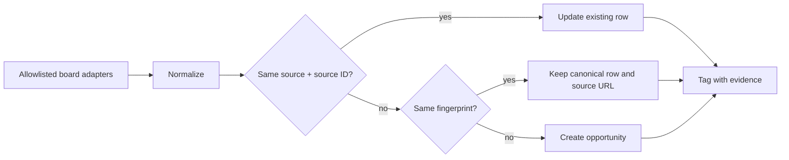

# Opportunity board — source research

> **Owner:** [@nicolasrufino](https://github.com/nicolasrufino) · **Last reviewed:** Oct 1, 2026 · **Audience:** Opportunity board team · **Type:** Research

## Decision

Start with **Greenhouse, Lever and Ashby**. They expose documented, unauthenticated JSON made for public career pages; their stable employer keys make a small adapter per ATS practical. Do not ingest Workday or community-list data until reuse permission is confirmed.

| Order | Source | Why now |
|---|---|---|
| 1 | Greenhouse | Small response, stable job IDs, update timestamps, optional descriptions |
| 2 | Lever | Plain-text descriptions, workplace type and pagination |
| 3 | Ashby | Plain-text descriptions, remote/workplace fields and publish time |

The API documentation permits building career pages, but broad aggregation/republication rights are not explicit. Before public v1.0, ask each provider or each employer whether this use is allowed **(verify)**.

## ATS endpoints

Only fetch employer boards deliberately added to a reviewed allowlist. Honor `429`, `Retry-After`, robots instructions and removal requests.

| Source | Public request | Useful response fields | Rate limit | Terms / decision |
|---|---|---|---|---|
| Greenhouse | `GET https://boards-api.greenhouse.io/v1/boards/{board_token}/jobs?content=true`; detail: `/jobs/{job_id}` | top-level `jobs`; `id`, `title`, `updated_at`, `location.name`, `absolute_url`, plus `content`, `departments`, `offices` when requested | No Job Board API limit is published **(verify)**; back off on `429` | Greenhouse documents this API for retrieving posts for an API-driven career site ([docs](https://docs.greenhouse.io/job-board.html), [overview](https://support.greenhouse.io/hc/en-us/articles/10568627186203-Greenhouse-API-overview)). Aggregator reuse is **(verify)**. |
| Lever | `GET https://api.lever.co/v0/postings/{site}?mode=json&skip={n}&limit={n}`; EU: `https://api.eu.lever.co/v0/postings/{site}`; detail: `/{posting_id}` | array of `id`, `text`, `categories` (`location`, `allLocations`, `commitment`, `team`, `department`), `descriptionPlain`, `hostedUrl`, `applyUrl`, `workplaceType`, optional `salaryRange` | No numeric GET limit is published **(verify)**. The documented 2 requests/second limit is for application `POST`, which this product will not call | Lever calls the Postings API publicly accessible and intended for custom job sites ([API](https://github.com/lever/postings-api/blob/master/README.md), [FAQ](https://hire.lever.co/developer/support)). Aggregator reuse is **(verify)**. |
| Ashby | `GET https://api.ashbyhq.com/posting-api/job-board/{JOB_BOARD_NAME}?includeCompensation=false` | `apiVersion`, `jobs[]`: `title`, `location`, `secondaryLocations`, `department`, `team`, `isListed`, `isRemote`, `workplaceType`, `descriptionPlain`, `publishedAt`, `employmentType`, `jobUrl`, `applyUrl` | No public numeric limit is published **(verify)**; back off on `429` | Ashby says the endpoint returns currently published posts for an organization's careers page ([docs](https://developers.ashbyhq.com/docs/public-job-posting-api)). Aggregator reuse is **(verify)**. |
| Workday | Observed tenant endpoint: `POST https://{host}/wday/cxs/{tenant}/{site}/jobs` with a JSON body such as `{"appliedFacets":{},"limit":20,"offset":0,"searchText":""}`; detail commonly `GET .../job/{externalPath}` **(verify)** | commonly `jobPostings[]` with `title`, `externalPath`, `locationsText`, `postedOn`; `total` and `facets` **(verify)** | Undocumented **(verify)** | Workday does not document this as a public job-board API. Its terms prohibit automated access, scraping and unapproved apps ([terms](https://www.workday.com/en-us/legal/site-terms.html)). Skip unless Workday and the tenant give written permission. |
| SmartRecruiters | `GET https://api.smartrecruiters.com/v1/companies/{companyIdentifier}/postings?limit={n}&offset={n}`; detail: `/postings/{postingId}` | list wrapper `limit`, `offset`, `totalFound`, `content[]`; posting fields include `id`, `uuid`, `name`, `location`, `department`, `function`, `typeOfEmployment`, `experienceLevel`, `ref` | Public Posting API limit is not stated **(verify)**. The documented 10 requests/second limit is for the authenticated Customer API, so do not apply it here | The vendor labels this a public Posting API ([endpoint](https://developers.smartrecruiters.com/docs/endpoints)). Customer terms restrict automated mining, so aggregation permission is **(verify)** ([terms](https://www.smartrecruiters.com/legal/terms-and-conditions/)). Defer until after v1.0. |

## Community lists

The former [`SimplifyJobs/Summer2026-Internships`](https://github.com/SimplifyJobs/Summer2026-Internships) URL now redirects to the 2027 repository. The maintained source is `.github/scripts/listings.json`; its contribution guide describes records such as company, title, locations, terms, sponsorship status, active flag, source URL and application URL, with generated Markdown tables ([format](https://github.com/SimplifyJobs/Summer2027-Internships/blob/dev/CONTRIBUTING.md), [data](https://github.com/SimplifyJobs/Summer2027-Internships/blob/dev/.github/scripts/listings.json)).

The repository currently has no detected license. A public GitHub repository without a license may be viewed and forked under GitHub's terms, but default copyright prevents general reproduction, distribution or derivative use ([GitHub guidance](https://docs.github.com/en/repositories/managing-your-repositorys-settings-and-features/customizing-your-repository/licensing-a-repository)). Therefore:

- use its schema and curation workflow as prior art;
- do not copy or ingest its rows in production without written permission;
- if permission arrives, pin a commit, retain attribution and ingest `listings.json`, not rendered README tables.

## Sources we skip

| Site | Why |
|---|---|
| LinkedIn | Its User Agreement/help explicitly bars crawlers, bots, scraping, copying and bypassing access limits ([policy](https://www.linkedin.com/help/linkedin/answer/a1341387)). |
| Indeed | Its current terms keep prohibitions against scraping, bots and automated activity in effect ([terms](https://www.indeed.com/legal?hl=en)). |
| Handshake | Its terms expressly prohibit bulk collection of student data, employer data, job descriptions and marketplace information by scripts or scraping ([terms](https://joinhandshake.com/legal/tos/)). |
| Workday | No supported public postings contract was found, and Workday's terms prohibit automated extraction ([terms](https://www.workday.com/en-us/legal/site-terms.html)). |

Do not use logged-in sessions, browser automation, proxy rotation or copied cookies. Link members to the original employer application page.

## Normalize and dedupe

1. Strip tracking parameters (`utm_*`, `gh_src`, `lever-source`) and trailing slashes; retain the original apply URL separately.
2. Upsert on `(source, sourceId)`. Also compute `dedupeKey = sha256(normalize(company) + "|" + normalize(title) + "|" + normalize(location))`.
3. Normalize case, punctuation, legal suffixes (`Inc`, `LLC`) and remote synonyms; never merge solely by title.
4. On cross-source collision, prefer the employer ATS URL, newest `sourceUpdatedAt`, and the richest description. Log the merge.
5. Mark a row closed only after it is absent in **two consecutive successful runs** from its source. A failed fetch must not close jobs.

## Class-year tagging

Store explicit eligible graduation years, the rule version and evidence text. `User.gradYear` already exists in the backend; filtering should include a role when its years contain that value or eligibility is unknown.

| Posting evidence | Tag |
|---|---|
| `new grad`, `university graduate`, `0–1 years`, graduation window containing 2026/2027 | matching senior/new-grad years |
| `junior`, `penultimate year`, graduation window containing 2028 | junior |
| `sophomore`, `second year`, programs named for sophomores | sophomore |
| `freshman`, `first year` | freshman |
| `bachelor's students`, `currently enrolled`, no year constraint | all undergraduate years |
| conflicting or absent evidence | `UNKNOWN`; show it rather than hiding it |

Use the current academic year plus `User.gradYear`; do not infer age. Named programs such as STEP change eligibility, so program names must not be hard-coded without a current quoted requirement **(verify)**.

## Sponsorship detection

Use three values: `YES`, `NO`, `UNKNOWN`, plus `sponsorshipEvidence`.

| Evidence | Value |
|---|---|
| `will sponsor`, `visa sponsorship available`, named eligible visa | `YES` |
| `no sponsorship`, `must be authorized ... without sponsorship`, `will not sponsor now or in future` | `NO` |
| only `authorized to work`, ambiguous citizenship/export-control language, or nothing | `UNKNOWN` |

Negation wins over positive keywords within the same requirement block. Never infer from company history, location or citizenship language. Display “Check posting” for `UNKNOWN`; link to the original text because eligibility is a legal/employer decision, not a promise from LOGICA.

## Operating guardrails

- One daily run; per-host concurrency `1`; conditional requests when `ETag`/`Last-Modified` is present.
- Exponential backoff with jitter for `429`/`5xx`; record counts and errors, never response bodies containing applicant data.
- Store job content only. Never submit applications or collect ATS candidate fields.
- Keep source attribution, fetched time and canonical link; remove a source promptly on request.
