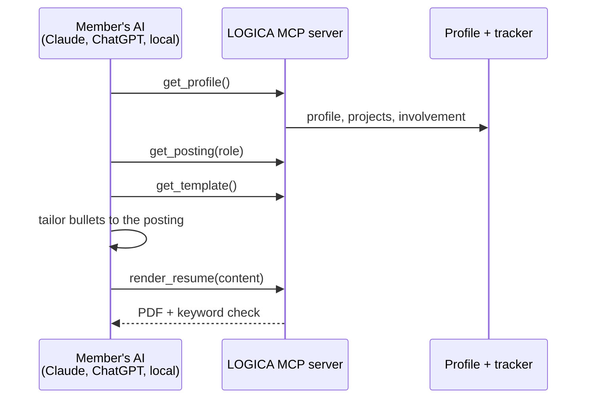
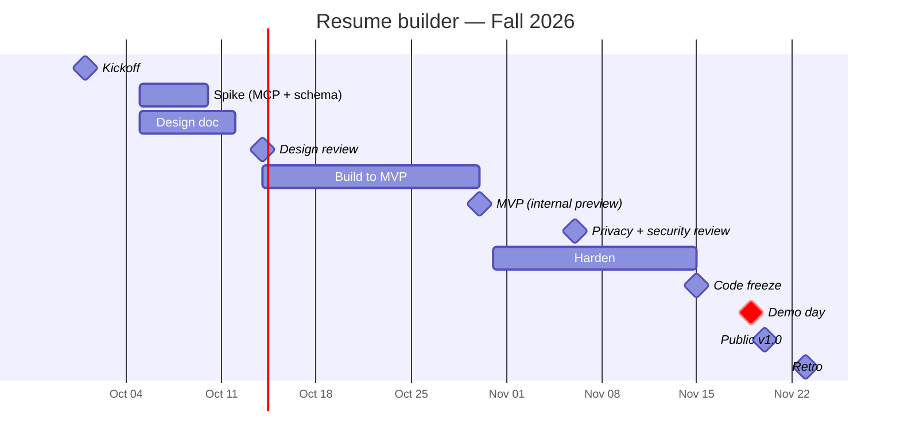

# Resume builder

> **Owner:** [@nicolasrufino](https://github.com/nicolasrufino) · **Last reviewed:** Sep 29, 2026 · **Audience:** Members and recruiters · **Type:** Project page

**Label:** `team: resume-builder` · **Priority:** main focus

A resume tailored to each posting, from one proven template. **Members' own AI does the writing through our MCP tools**, so the club pays for no tokens.

| Milestone | Done when | Area |
|---|---|---|
| 1. Spike | One template renders to PDF from a JSON résumé | Backend |
| 2. MCP tools | `get_profile`, `get_posting`, `get_template`, `render_resume` work from a real AI client | Backend |
| 3. Keyword check | Plain code lists posting terms missing from the resume (no AI) | Backend |
| 4. Resume page | Preview, versions per application, download | Frontend |

**Template:** one single-page layout recruiters already trust; bullets as "did X, measured by Y, by doing Z". No custom designs.
**You learn:** MCP servers, tool design for AI agents, PDF rendering.

## Timeline — Fall 2026

| Milestone | Date |
|---|---|
| Kickoff | Thu Oct 1 |
| OKRs published | Tue Oct 6 |
| Spike (MCP server + resume schema) | Oct 5–9 |
| Design doc due | Sun Oct 11 |
| Design review | Wed Oct 14 |
| MVP · internal preview | Fri Oct 30 |
| Privacy + security review | Fri Nov 6 |
| Code freeze | Sun Nov 15 |
| **Demo day** | **Thu Nov 19** |
| Public v1.0 | Fri Nov 20 |
| Retro | Mon Nov 23 |
| Showcase (v1.1) | Thu Dec 3 |
| OKR grades | Fri Dec 11 |

## Artifacts

| File | What | Status |
|---|---|---|
| [okrs.md](okrs.md) | Objectives and key results, graded 0–1 | Due Tue Oct 6 |
| [design-doc.md](design-doc.md) | 1–3 page design doc | See timeline |
| [status/](status/) | Weekly snippet every Monday | From Mon Oct 12 |
| [launch-checklist.md](launch-checklist.md) | Must pass before the public release | Before the demo |
| [demos/](demos/) | Demo day writeup, slides, video | 2026-11-19 |
| [retro.md](retro.md) | Blameless retro and findings | After the demo |
