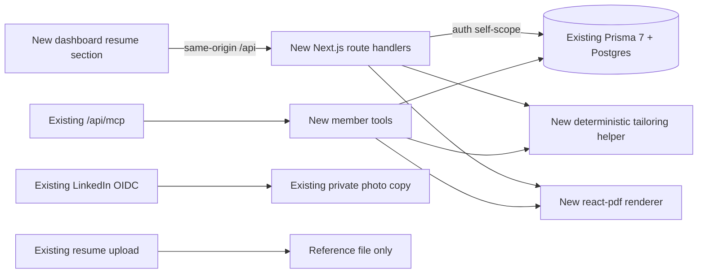

# Resume builder — build plan

> **Owner:** [@nicolasrufino](https://github.com/nicolasrufino) · **Last reviewed:** Oct 1, 2026 · **Audience:** Resume builder team · **Type:** Build plan

## v1 contract

One authenticated member can maintain structured resume facts, paste a job posting, create an editable tailored version, preview/download an ATS-safe PDF, and optionally do the writing with their own AI through LOGICA MCP. LinkedIn supplies the existing copied photo only; the resume template does not show it.

## Architecture



### Grounding map

| Plan | Existing anchor | Change |
|---|---|---|
| Auth | backend `auth.ts`; handlers call `auth()` | Every HTTP route derives `session.user.id`; no client-supplied owner ID |
| Database | backend `lib/prisma.ts`, `prisma/schema.prisma`, migrations | Add models/relations below plus a Prisma migration |
| Validation | `lib/upload.ts`; explicit route validation; MCP `inputSchema` in `lib/mcp-tools.ts` | Add one shared strict resume parser used by HTTP and MCP; new dependency only if selected in spike |
| MCP | `app/api/mcp/route.ts`, `lib/mcp-token.ts`, `lib/mcp-tools.ts`, `lib/stage.test.ts` | Add four MEMBER-visible tools; tool runners always query by `caller.id` |
| Profile data | `app/api/profile/route.ts`, `lib/involvement.ts` | Seed name/email/major/grad year/involvement; add member-confirmed resume facts |
| Existing file | `app/api/profile/resume/route.ts`, `app/api/resume/[userId]/route.ts` | Keep as reference upload/download; do not overwrite it with generated output |
| LinkedIn | `app/api/linkedin/*`, `lib/linkedin-oauth.ts` | No experience import; keep token-discard/photo-delete behavior |
| Frontend shell | `src/app/dashboard/layout.tsx`, `src/components/dashboard/Dashboard.tsx`, `types.ts`, `Profile.tsx` | Add a `resume` section inside the persistent dashboard; keep loading/empty/error/signed-out states |
| Browser API | frontend `src/lib/api.ts`, `next.config.ts` | Same-origin `/api` calls only |
| Tests | backend Vitest route/helper tests; frontend Vitest pure helpers and `e2e/*.e2e.ts` Playwright smoke tests | Extend existing runners; add no test framework |

### New data model

Names below are proposals, not current models.

```mermaid
erDiagram
  User ||--o| ResumeProfile : owns
  User ||--o{ TargetApplication : owns
  User ||--o{ ResumeVersion : owns
  TargetApplication ||--o{ ResumeVersion : has
  ResumeProfile {
    string userId PK
    json content
    datetime updatedAt
  }
  TargetApplication {
    string id PK
    string userId FK
    string role
    string company
    text postingText
    string postingUrl
    datetime createdAt
  }
  ResumeVersion {
    string id PK
    string userId FK
    string targetApplicationId FK_nullable
    string title
    json content
    datetime createdAt
    datetime updatedAt
  }
```

- Add `resumeProfile`, `targetApplications`, and `resumeVersions` relations to existing `User`, all `onDelete: Cascade`, with indexes on `userId` and `(userId, updatedAt)`.
- `content` is a strict JSON Resume-inspired subset: basics, education, work, projects, skills. Reject unknown root sections, oversized strings, too many entries and URLs outside `http/https`.
- Store member-authored facts and version JSON in Postgres. Do not store generated PDFs, raw prompts, model responses, access tokens or scraped LinkedIn data.
- `TargetApplication` is deliberately new: the current backend has membership applications, not a job tracker. If the opportunity-board team ships an equivalent model first, adapt to it rather than duplicate it.

### New HTTP routes

| Route | Rule | Result |
|---|---|---|
| `GET/PATCH /api/resume-profile` | signed-in MEMBER; self only | Read/update confirmed facts |
| `GET/POST /api/target-applications` | signed-in MEMBER; list/create own | Store role/company/posting text |
| `GET/PATCH/DELETE /api/target-applications/[id]` | row `userId === session.user.id` | Read/update/delete target; delete or detach versions per confirmed UX |
| `GET/POST /api/resume-versions` | signed-in MEMBER; list/create own | Create immutable snapshot initially |
| `GET/PATCH/DELETE /api/resume-versions/[id]` | row `userId === session.user.id` | Edit/delete one version |
| `POST /api/resume-versions/[id]/render` | row owner only; `Cache-Control: private, no-store` | Stream PDF attachment; never persist bytes |
| `POST /api/resume-tailor` | signed-in MEMBER; validated profile + posting | Return ranked existing bullets and missing terms; no prose generation |

Reject SPEAKER accounts for this member product even though the existing upload route permits them. Return 401 signed out, 403 wrong account, 404 for another member’s row to avoid exposing existence, and 400 for invalid content.

### MCP tools

Use the existing stateless bearer transport and `Caller` from `lib/mcp-token.ts`.

| Tool | Input/output | Authorization |
|---|---|---|
| `get_profile` | confirmed resume profile + LOGICA involvement | `MEMBER`, `BOARD`, `EXEC_BOARD`; query `caller.id` |
| `get_posting` | `applicationId` → caller-owned target | same; owner predicate in query |
| `get_template` | schema, limits and one role template | same; no personal data |
| `render_resume` | validated content + optional target ID → PDF download token/response contract decided in spike | same; store only a caller-owned version |

`render_resume` must not accept a `userId`. Register tools in `TOOLS`, derive lists with existing `toolsFor()`, and update `lib/stage.test.ts` plus route/tool tests together.

## Privacy and deletion

| Data | Stored where | Who can see it | Deletion |
|---|---|---|---|
| Name/email/major/grad year, involvement | existing `User` and related records | member; existing authorized surfaces | existing account/data process |
| LinkedIn subject + copied photo | existing `User.linkedinSub/photoData` | signed-in photo route currently serves any user ID; narrow to self for resume use **(verify)** | existing `DELETE /api/linkedin/disconnect` |
| Original uploaded resume | existing `User.resumeData` | self and BOARD+ today | existing `DELETE /api/profile/resume` |
| Resume facts, postings, versions | new owner-linked Postgres rows | owner only in v1; not board | per-row delete plus cascade on account deletion |
| Rendered PDF | response memory only | authenticated owner | gone after response |
| MCP token | existing hashed `McpToken` | secret shown once; hash in DB | existing revoke path/cascade |
| Member AI disclosure | no provider data stored by LOGICA | member chooses provider | member manages provider history |

Before launch: publish plain-language consent covering data purpose, visibility, retention, AI-provider disclosure and deletion; run the Nov 6 privacy/security review. Logs must contain IDs/status, never resume content, posting text, tokens or PDF bytes.

## Schedule

| Week | Dates | Exit condition |
|---|---|---|
| Kickoff + spike | Oct 1–9 | OKRs Oct 6; strict schema and `@react-pdf/renderer` produce an ATS-readable PDF; record cold/warm render time and bundle impact |
| Design review | Oct 10–14 | Design doc and model/routes approved Wed Oct 14; no unresolved LinkedIn experience assumption |
| Vertical slice | Oct 15–23 | Authenticated member edits facts, creates one target/version and downloads a PDF through real backend/frontend |
| MVP | Oct 24–30 | All four MCP tools work from a real client; rules keyword check; internal preview Fri Oct 30 |
| Privacy review + harden | Oct 31–Nov 6 | Data inventory, consent, authorization/deletion tests and privacy/security review pass Fri Nov 6 |
| Harden + freeze | Nov 7–15 | Accessibility, narrow layout, PDF parsing QA, error/empty states; fixes only after Sun Nov 15 |
| Demo + release | Nov 16–20 | Demo Thu Nov 19; public v1.0 Fri Nov 20 |
| Retro + showcase | Nov 21–Dec 3 | Retro Mon Nov 23; measured feedback and v1.1 showcase Thu Dec 3 |

## Issue-ready backlog

Dependencies use task numbers; all tasks also depend on repository setup/CI already present.

| # | Title | Area | Size | Acceptance criteria | Dependencies |
|---:|---|---|:---:|---|---|
| 1 | Spike strict resume schema | Backend | M | Sample valid JSON passes; unknown/oversized/unsafe URL cases fail; decision recorded | — |
| 2 | Spike React-pdf on Vercel | Backend | M | One-page sample renders; text extraction order passes; cold/warm time and bundle size recorded | 1 |
| 3 | Add resume Prisma models + migration | Backend | M | Proposed models/relations/indexes migrate; cascade behavior tested against dedicated test DB | 1 |
| 4 | Build shared resume validator | Backend | M | HTTP and MCP call one parser; unit tests cover limits, dates, URLs and unknown keys | 1 |
| 5 | Add resume-profile API | Backend | M | MEMBER can GET/PATCH own facts; 401/403/invalid cases tested | 3, 4 |
| 6 | Add target-application APIs | Backend | M | Owner CRUD works; cross-account access returns 404; posting length capped | 3 |
| 7 | Add resume-version APIs | Backend | L | Owner list/create/edit/delete works; content validated; target ownership enforced | 3, 4, 6 |
| 8 | Implement deterministic keyword helper | Backend | M | Stable normalized present/missing terms and ranked bullets; stop-word/empty tests pass | 4 |
| 9 | Add tailoring API | Backend | S | Authenticated MEMBER gets helper output only; no invented prose or score | 5, 6, 8 |
| 10 | Build ATS-safe PDF template | Backend | L | US Letter, single column, selectable text, standard headings, no tables/photo/header/footer | 2, 4 |
| 11 | Add authenticated render route | Backend | M | Owner receives PDF attachment with private/no-store/nosniff; cross-account/invalid tests pass | 7, 10 |
| 12 | Add `get_profile` MCP tool | Backend | S | Tool returns caller-only confirmed facts/involvement; stage and owner tests pass | 5 |
| 13 | Add `get_posting` MCP tool | Backend | S | Caller-owned ID works; foreign/missing ID reveals no row | 6 |
| 14 | Add `get_template` MCP tool | Backend | S | Returns schema/limits/template with no personal data | 4 |
| 15 | Add `render_resume` MCP tool | Backend | M | Valid caller content creates caller-owned version and render result; invalid/cross-owner cases fail | 7, 10, 11 |
| 16 | Add Resume dashboard section | Frontend | M | New `resume` section uses persistent dashboard shell and member nav; signed-out/loading/error/empty states present | 5 |
| 17 | Build structured facts editor | Frontend | L | Labeled keyboard-usable forms edit education/work/projects/skills; inline validation and narrow layout work | 5, 16 |
| 18 | Build target posting form | Frontend | M | Member enters role/company/text/optional URL; errors preserve input | 6, 16 |
| 19 | Build tailoring review screen | Frontend | L | Present/missing terms and ranked existing bullets are editable; UI makes no ATS/hiring score claim | 9, 17, 18 |
| 20 | Build preview/version/download UI | Frontend | L | Create/edit/delete/list versions; preview handles overflow; download uses real render route | 7, 11, 19 |
| 21 | Write privacy and AI disclosure copy | Frontend | S | Before connect/import/MCP use, copy states data, audience, deletion and external AI disclosure | 12–16 |
| 22 | Add deletion flow | Frontend | M | Member deletes a version, target and all resume-builder data with confirmation; UI reflects result | 6, 7, 16 |
| 23 | Add backend authorization regression suite | QA | M | 401, SPEAKER 403, two-member isolation, cascade deletion, token revocation all pass in Vitest | 5–15 |
| 24 | Add PDF fixture checks | QA | M | CI extracts text/read order from short, long and Unicode fixtures; no blank/extra page regressions | 10, 11 |
| 25 | Add authenticated Playwright journey | QA | M | Seeded member completes edit → target → tailor → version → PDF; keyboard and phone-width checks documented | 16–20 |
| 26 | Run internal preview + triage | QA | M | ≥3 members for ≥2 days; issues use Page · Did · Saw · Expected; blockers closed or release-scoped | 21–25 |

**Good first issues:** #9 (small route using an existing helper), #13, #14, and #21. Pair a new contributor on #1 or #24 because schema/PDF edge cases are deceptively security-sensitive.

## Test plan

| Layer | Runner/convention | Required coverage |
|---|---|---|
| Pure backend | existing Vitest, like `lib/upload.test.ts` | schema boundaries, deterministic keyword output, PDF filename/content disposition, text extraction helper |
| Backend routes | import handlers directly, like existing `app/api/**/route.test.ts` | signed out, MEMBER success, SPEAKER denied, wrong owner, malformed JSON, content limits, delete/cascade |
| MCP | existing `app/api/mcp/mcp.test.ts` and `lib/stage.test.ts` | token required/revoked; list visibility; every tool self-scoped; invalid arguments are tool errors |
| Frontend helpers | existing Vitest in `src/lib/*.test.ts` | form-to-schema mapping, overflow warnings, keyword display mapping |
| Browser | existing Playwright in `e2e/*.e2e.ts` | public smoke remains backend-independent; new authenticated seeded journey runs where backend/test DB are available **(new CI wiring)** |
| Manual QA | role + device matrix | member/board/speaker, keyboard only, 375 px and desktop, empty/error/slow states, Chrome/Safari PDF download |

Release commands remain the repository conventions: backend `npx prisma generate`, `npm run lint`, `npx tsc --noEmit`, `npm test`, `npm run build`; frontend `npm run lint`, `npx next typegen`, `npx tsc --noEmit`, `npm test`, `npm run build`, `npx playwright test`.

## Risks

| Risk | Signal | Mitigation | Owner checkpoint |
|---|---|---|---|
| LinkedIn experience import is impossible | Team asks for more OAuth scopes | Photo-only boundary in product copy; manual facts first | Design review Oct 14 |
| PDF fails ATS parsing | Extracted order differs or Greenhouse import loses fields | Single-column text template + fixture extraction | MVP Oct 30 |
| Cross-member leak | Route loads by `id` without owner predicate | `userId` in every query; two-member regression suite | Privacy review Nov 6 |
| AI invents claims | New bullet contains unsupported metric/skill | Rules use existing bullets; member AI output always reviewed | Internal preview |
| Resume overflows one page | Preview/render page count >1 | Length caps, warnings and deterministic section trimming; never silently drop content | MVP Oct 30 |
| Renderer is too heavy on Vercel | Bundle/cold render exceeds spike budget | Measure #2; fall back to browser-side react-pdf, then remote rendering only after privacy review | Oct 9 |
| Tracker model conflicts with opportunity board | Equivalent model lands first | Adapt before migration; avoid parallel models | Before #3 |
| Uploaded export changes format | Parser fixture fails | Keep import optional; manual editor is always available | Harden phase |
