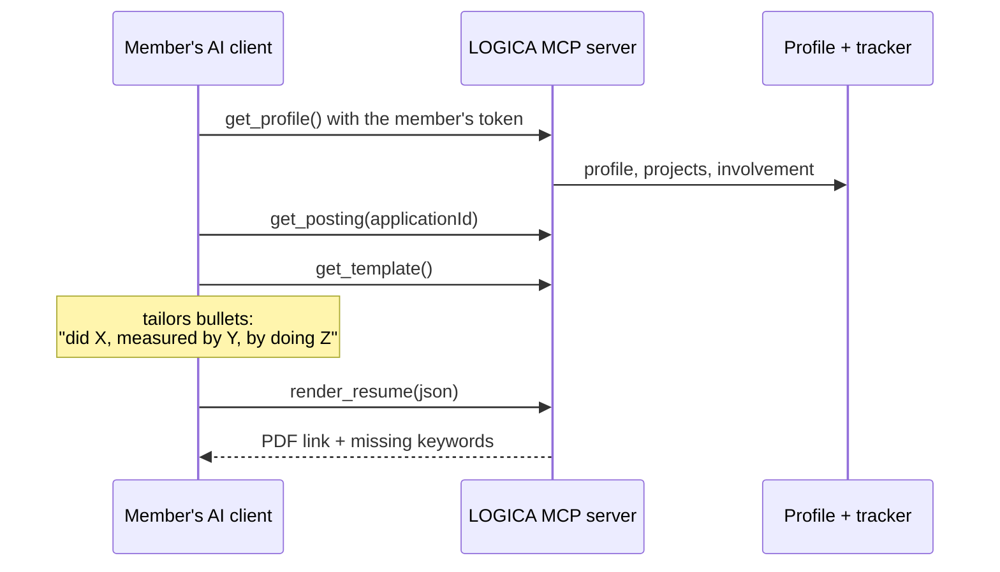

# Resume builder — design doc

> **Owner:** [@nicolasrufino](https://github.com/nicolasrufino) (draft v0) · **Last reviewed:** Oct 1, 2026 · **Audience:** Resume builder team · **Type:** Design doc · **Status:** Draft v0. The team owns it from kickoff (Oct 1); review Wed, Oct 14, 2026.

## Context and scope

Every posting rewards different keywords, so members need a resume tailored to each job, and writing one from scratch every time is slow. The club can't pay for AI tokens. So the member's own AI (Claude, ChatGPT or a local model) does the writing, and LOGICA supplies the data, the template and the rendering through MCP tools.

**Builds on:** the backend's MCP server and per-member MCP tokens (built by **Nicolas Rufino**), member profiles with an involvement summary (**Ramon Vazquez**), the profile resume upload, and the member profile design (**Mily**).

## Goals and non-goals

| Goals (v1.0, Nov 20, 2026) | Non-goals |
|---|---|
| One proven single-page template | Multiple visual themes |
| MCP tools: `get_profile`, `get_posting`, `get_template`, `render_resume` | Running any AI on club infrastructure |
| A keyword check against the posting, with no AI | A "score" that claims to predict hiring |
| Versions saved per application in the tracker | Sharing resumes publicly |

## Design

**Data:** `ResumeVersion`: userId, trackedApplicationId (optional), content (JSON, validated against the template schema), createdAt. Rendered PDFs are regenerated on demand, not stored.

**Template:** a JSON schema (header, education, experience, projects, skills) and one renderer. The schema is the contract the AI must fill.

## Alternatives considered

| Option | Why not |
|---|---|
| Call an AI API from the backend | Costs the club tokens and adds a key to protect |
| A résumé editor in the browser | Slower to build and doesn't tailor per posting |
| LaTeX rendering | Heavy on serverless; React-pdf keeps the v1 renderer in the existing TypeScript/React stack |

## Cross-cutting concerns

- **Privacy (reviewed Fri, Nov 6, 2026):** resumes and LinkedIn data are personal. Tools only return the caller's own data, tokens are revocable, and there's a delete path.
- **Security:** `render_resume` validates input against the schema, and there are no file writes outside the member's records.

## Milestones

[MVP, Oct 30, 2026](https://github.com/uic-logica/backend/milestone/3) → [v1.0, Nov 20, 2026](https://github.com/uic-logica/backend/milestone/4).

## Open questions

Resolved choices and execution detail: [research](research.md) · [build plan](build-plan.md).

1. **Template:** one US Letter, single-column, text-only React-pdf layout inspired by Jake's Resume—ATS-safe and lighter on Vercel than Chromium/TeX.
2. **Posting:** accept pasted posting text in a new owner-scoped target row; adapt to the opportunity-board tracker if its equivalent model lands first.
3. **AI client:** explain setup and the external-provider privacy boundary on MCP Connections and the resume empty state.
4. **LinkedIn:** keep OIDC for the copied photo only; work history comes from member-confirmed structured entry because self-serve scopes do not expose experience.
