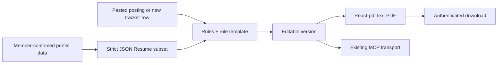

# Resume builder — research

> **Owner:** [@nicolasrufino](https://github.com/nicolasrufino) · **Last reviewed:** Oct 1, 2026 · **Audience:** Resume builder team · **Type:** Research

## Findings

Facts are cited or tied to the current repos. Recommendations are labeled.

### LinkedIn: the hard boundary

| Question | Fact | Product consequence |
|---|---|---|
| What can a self-serve app request? | OpenID Connect uses `openid profile email`. `profile` returns a lite profile: subject ID, name and picture; `email` can return the primary email. The documented UserInfo claims do not include positions, education, skills or certifications. [LinkedIn OIDC](https://learn.microsoft.com/en-us/linkedin/consumer/integrations/self-serve/sign-in-with-linkedin-v2) | Keep the existing connect flow for photo/identity only. Never promise experience import. |
| Is this already true in LOGICA? | **Observed:** backend `app/api/linkedin/connect/route.ts` requests exactly those scopes; `callback/route.ts` stores `linkedinSub` and a validated photo copy, then discards the token. Frontend `Profile.tsx` says experience is not provided. | Extend this flow only for clearer consent/deletion copy; do not add scopes speculatively. |
| Can a normal app fetch work history? | The open-permissions list exposes lite profile/email, while sales and other APIs require approved programs. [LinkedIn API access](https://learn.microsoft.com/en-us/linkedin/shared/authentication/getting-access) | Treat employment-history API access as unavailable to this non-partner student app in 2026. |
| Can we scrape the profile? | LinkedIn API terms prohibit storing or transferring LinkedIn content obtained by scraping/crawling outside the APIs. [API Terms §3.1](https://www.linkedin.com/legal/l/api-terms-of-use) | No scraping, browser automation or third-party “LinkedIn scraper.” |
| What must consent/deletion cover? | The terms require clear collection/use/storage/deletion disclosure and deletion on member request or account closure. Storage must be segregable and limited to the service need. [API Terms §§4–5](https://www.linkedin.com/legal/l/api-terms-of-use) | List fields before connect; make disconnect/delete immediate; keep data owner-scoped. |
| Is OIDC identity verification? | LinkedIn says OIDC does not verify identity and must not be marketed that way. [LinkedIn OIDC](https://learn.microsoft.com/en-us/linkedin/consumer/integrations/self-serve/sign-in-with-linkedin-v2) | Say “connected,” never “verified.” |

**Recommendation:** LinkedIn connection remains the photo source, not the experience source. Experience comes from member-confirmed structured data.

### Experience fallbacks

| Path | What it gives us | Tradeoff | v1 |
|---|---|---|---|
| Manual structured entry | Clean, attributable experience/project/education data | More typing | **Required baseline** |
| Member-uploaded LinkedIn data export | LinkedIn documents that members can download their own archive; its Positions and Education categories contain resume-useful fields. [Download your data](https://www.linkedin.com/help/linkedin/answer/a1339364) | Archive parsing and category/file shape may change; importing a member-provided archive into this use should receive a terms/privacy review **(verify)** | Optional after manual entry works |
| Member-uploaded “Save to PDF” profile | Familiar one-file fallback | LinkedIn offers profile-to-PDF, but availability and output vary by account/locale **(verify)**; PDF parsing is lossy | Optional, never authoritative |
| Existing uploaded resume | Backend already accepts PDF/DOC/DOCX at `app/api/profile/resume/route.ts` | Parsing Word/PDF safely is new work; original may contain stale content | Keep as reference download in v1; structured entry remains source of truth |

Every import must show a review screen. Nothing becomes a claim on a resume until the member confirms or edits it.

### ATS-safe output

Greenhouse lists graphics, image-only files, tables, headers/footers, text boxes and column layouts as common causes of failed or partial parsing. It recommends document PDFs or Word files with clear sections. [Greenhouse resume parsing](https://support.greenhouse.io/hc/en-us/articles/200989175-Unsuccessful-resume-parse)

| Use | Avoid |
|---|---|
| One text column; selectable text | Tables, sidebars, text boxes, icons and photos |
| Standard headings: Education, Experience, Projects, Skills | Important content in headers/footers |
| Simple bullets and chronological dates | Skill bars, charts and decorative glyphs |
| Embedded common font; US Letter default | Scanned/image-only PDF |
| Honest keywords in context | Hidden text or keyword stuffing |

**Acceptance check:** extract text from every generated PDF and assert the name, headings and representative bullets appear in reading order. A recruiter still decides quality; the product must not claim an “ATS score.”

## Rendering options

| Option | Fit with the real stack | Vercel cost/operations | Decision |
|---|---|---|---|
| HTML → PDF with headless Chromium | Familiar HTML/CSS; Puppeteer supports `Page.pdf()`. [Puppeteer PDF guide](https://pptr.dev/guides/pdf-generation) | Chromium increases bundle size, cold start, memory and active CPU. Vercel bills active CPU plus provisioned memory and documents plan limits. [pricing](https://vercel.com/docs/functions/usage-and-pricing), [limits](https://vercel.com/docs/functions/limitations) | Good fidelity, highest serverless risk; spike only as fallback |
| `@react-pdf/renderer` | React/TypeScript matches both repos; Node can return a stream. [React-pdf Node API](https://react-pdf.org/docs/v2/node) | No browser binary; smaller operational surface. Exact bundle/render time on this backend **(verify)** | **Recommended v1 renderer** |
| Typst | Strong typesetting and fast native CLI; separate template language/runtime | Native binary packaging and Vercel compatibility for this deployment **(verify)** | Revisit if typography becomes a product need |
| LaTeX | Proven templates such as MIT-licensed [Jake's Resume](https://www.overleaf.com/latex/templates/jakes-resume/syzfjbzwjncs) | TeX distribution is heavy; escaping untrusted input is security-sensitive | Reference layout only; do not ship the toolchain |

Cost illustration: Vercel’s Cleveland example rates are $0.128/active CPU-hour and $0.0106/GB-hour. At an assumed 2 GB, 1 active CPU-second and 2 wall-seconds, 1,000 renders are about **$0.047 compute**, before plan allowance and transfer: `1000 × (1/3600 × .128 + 2×2/3600 × .0106)`. This is an estimate, not a benchmark **(verify)**. Benchmark both cold and warm renders during the spike.

## Tailoring approaches

| Approach | Behavior | Cost | Privacy | Recommendation |
|---|---|---|---|---|
| Rules + role templates | Rank member-confirmed bullets by tagged skills; suggest missing exact terms; never invent text | No token cost | Data stays in LOGICA | v1 default |
| Member's AI through MCP | `get_profile`, `get_posting`, `get_template`, `render_resume`; member chooses their AI provider | Club pays $0 | Resume and posting go to the member's chosen provider under that provider's terms | v1 optional path, with an explicit disclosure |
| Club-hosted LLM | Server sends profile/posting to a model and stores output | Example assumption: 6k input + 2k output on GPT-5 mini at $0.25/$2 per 1M tokens ≈ **$0.0055/resume**. [OpenAI model pricing](https://developers.openai.com/api/docs/models/gpt-5-mini) Actual tokens/model prices vary **(verify)** | Adds a processor, key, retention choices and hallucination risk | Not v1 |

Rules-first tailoring:

1. Normalize posting text into lowercase tokens/phrases; remove a small stop-word list.
2. Compare against member-confirmed skills and bullet text.
3. Rank existing bullets by exact skill/phrase overlap and role template weights.
4. Show “present,” “missing,” and “member review needed”—never a hiring probability.
5. Require the member to approve the final version.

## Prior art

| Project | Reuse | Do not copy blindly |
|---|---|---|
| [JSON Resume](https://jsonresume.org/schema) | Section names and portable JSON shape | Its schema permits extensions; v1 needs a strict, bounded subset and length limits |
| [Reactive Resume](https://github.com/reactive-resume/reactive-resume) | Live preview, JSON portability, permanent deletion; it now uses client-side `@react-pdf/renderer` | It is a full product with many templates and services; do not fork its architecture |
| [Jake's Resume](https://www.overleaf.com/latex/templates/jakes-resume/syzfjbzwjncs) | Compact one-page CS information hierarchy and MIT-licensed reference | It uses LaTeX/table constructs; reproduce the hierarchy, not the runtime or multi-column tricks |

## Recommended v1 stack

- **Data:** new normalized profile tables plus `ResumeVersion.content` JSON; use a strict JSON Resume-inspired schema.
- **Input:** existing LOGICA profile + manual entry. Keep LinkedIn OIDC for photo only; add an optional member-uploaded export after privacy review.
- **Tailoring:** deterministic rules/templates in the product; optional member-owned AI through the existing MCP server.
- **Rendering:** `@react-pdf/renderer`, one US Letter, single-column, text-only template; regenerate on download and do not store PDFs.
- **Storage:** current Prisma/Postgres patterns at club scale; keep generated JSON owner-scoped and cascade-delete it.

This fits the installed TypeScript/React stack, avoids Chromium/TeX packaging, costs the club no AI tokens, and respects what LinkedIn actually exposes.
